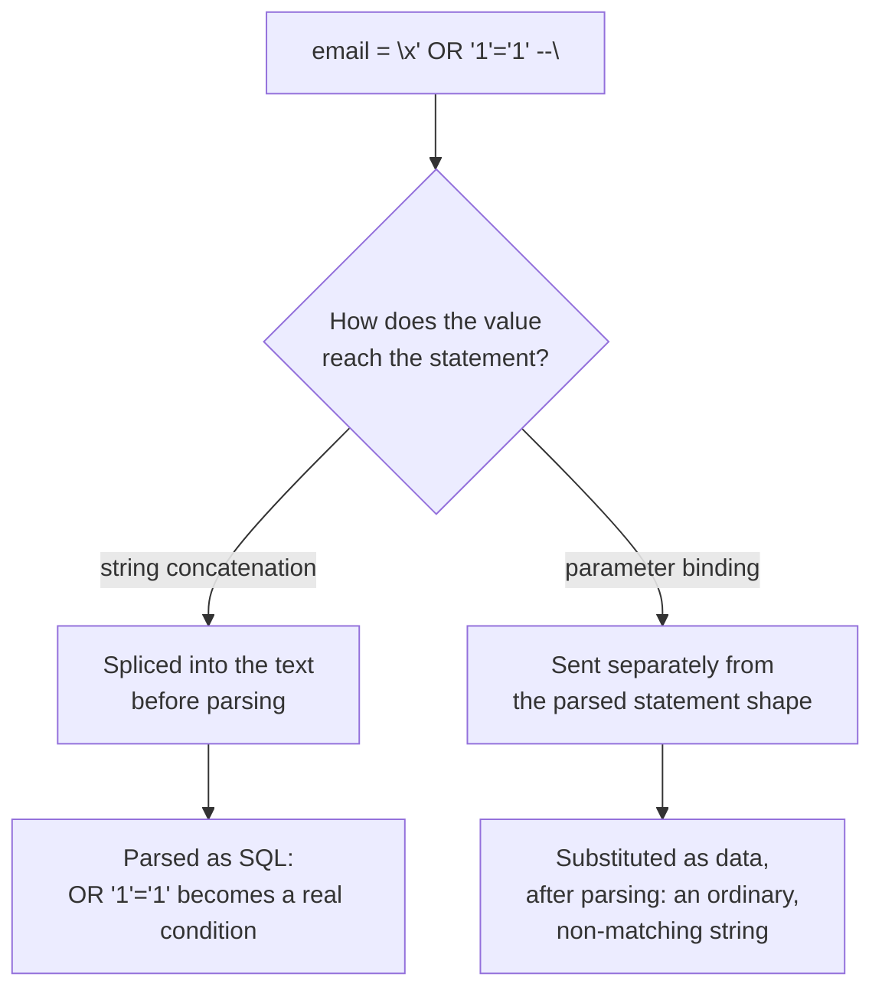

# Lesson 49. SQL Injection and Parameterised Statements

**Mission link:** Lesson 47 read a captured ORM statement and called every bound value, visible as a `%s` placeholder, "the one thing hand-written SQL gets wrong often enough to matter," without stopping to say why concatenation breaks or what a bound parameter actually does differently. This lesson is that explanation, and the discipline hand-written SQL has to choose deliberately, since nothing forces it the way an ORM's query-building API does.
**Primary source:** [OWASP SQL Injection Prevention Cheat Sheet](https://cheatsheetseries.owasp.org/cheatsheets/SQL_Injection_Prevention_Cheat_Sheet.html)
**Prerequisites:** [Lesson 47](0047-reading-orm-output.md), [Lesson 44](0044-reviewing-a-query.md)

## Warm-up

1. ▢ Per lesson 47, what did the `%s` in a captured statement's log line actually stand for, and where was the real value?

<details markdown="1"><summary>Check</summary>

A bound parameter: the placeholder marks where a value belongs in the statement text, and the real value travelled to the server separately, substituted by the driver rather than spliced into the text the log shows.

</details>

2. ▢ Per lesson 44, what is the first question a query review asks, before speed or a plan is even considered?

<details markdown="1"><summary>Check</summary>

What rows it returns. A fast statement that returns, or matches, the wrong rows is worse than a slow correct one, and this lesson is exactly a case where a statement's *meaning* changes rather than its speed.

</details>

## Know this

### Concatenation lets a value change what the statement means, not only what it matches

A query built by joining strings hands the database one piece of text with no memory of which part was code and which part was somebody's input:

```python
query = "SELECT * FROM customers WHERE email = '" + email + "'"
cur.execute(query)
```

If `email` arrives as the ordinary string `alice@example.com`, this reads exactly as intended. If it arrives as `x' OR '1'='1' --`, the text the database actually parses is:

```sql
SELECT * FROM customers WHERE email = 'x' OR '1'='1' --'
```

`--` starts a comment, discarding the stray trailing quote, and `'1'='1'` is true for every row, so the statement returns every customer rather than none. Nothing here is a bug in the database: it correctly parsed and ran exactly the SQL it was handed. The bug is that the application built that SQL by treating a value as though it were also allowed to be code, and a value chosen by whoever controls `email` decided what the statement was.

### A parameterised statement never builds the value into the statement text at all

```python
query = "SELECT * FROM customers WHERE email = %s"
cur.execute(query, (email,))
```

The driver sends the statement's shape, `... WHERE email = %s`, and the value `email` as two separate things; the server parses the shape once, with a hole where the value goes, and the value is substituted into that hole afterward as data, never re-parsed as SQL. The same `x' OR '1'='1' --` arriving through this path is not "escaped" or "sanitised": it is simply the literal string the database looks for in the `email` column, matching nothing, because there was never a point at which the database re-read it looking for SQL syntax. This is what the glossary already named a **bound parameter**, and it is what the OWASP cheat sheet means by the database distinguishing code from data "regardless of what user input is supplied": the distinction is structural, made before any value arrives, not a property of which values happen to be safe.

### Escaping is the alternative the primary source names and then discourages

An older style tries to neutralise a value by hand, doubling every single quote it contains before splicing it in. The primary source lists this as a real, documented option and then calls it strongly discouraged, because the escaping rule is specific to the engine, the context, and the character in question: which characters need escaping differs by database, a value can enter through more than one quoting convention in the same statement, and a single missed case anywhere in a codebase reopens the exact hole a parameterised statement closes structurally. Parameterisation is preferred not because escaping never works, but because it removes the category of mistake instead of asking every call site to get a context-specific rule right every time.

### A stored procedure is only as safe as its own body

The primary source's second defence, a properly written stored procedure, is safe for the same structural reason: its parameters are automatically parameterised, the same substitution-after-parsing this lesson already described, just defined once in the database rather than at each call site. The caveat is exact: if the procedure's own body builds a further SQL string by concatenating one of its parameters into it, and runs that string dynamically, the same vulnerability reappears one level in, unprotected by the outer call having been parameterised. "Parameterised" describes how a value reaches the engine that finally runs it, not which layer of code happened to call it; a stored procedure is a wrapper, not an exemption.

### What lesson 47 had already shown, said plainly

Every statement lesson 47 captured from an ORM bound its values this way, visible as the placeholder sitting where a country code or a customer id belonged; that lesson called it the one thing the generated SQL got right often enough not to need review. The reason it needed no review is exactly this lesson's subject: an ORM's own query-building API has nowhere to put a value except as a bound parameter, so reaching for concatenation instead takes deliberate, unusual effort. Hand-written SQL has no such API forcing the choice, which is why the discipline has to be chosen on purpose, every time a value from outside the statement enters one.



## Practice

1. ▢ A login check runs `"SELECT * FROM customers WHERE email = '" + email + "' AND password = '" + password + "'"`. An attacker supplies `email = "admin@example.com' --"` and any `password`. Predict what the database actually receives and runs.

<details markdown="1"><summary>Hint</summary>

Work out where the comment marker `--` falls once the string is assembled, and what it does to everything after it.

</details>

<details markdown="1"><summary>Check</summary>

`SELECT * FROM customers WHERE email = 'admin@example.com' --' AND password = '...'`. Everything from `--` onward is a comment, so the password check never runs at all; the statement matches on email alone, with whatever password the attacker supplied being ignored entirely.

</details>

2. ▢ The same login check is rewritten as `cur.execute("SELECT * FROM customers WHERE email = %s AND password = %s", (email, password))`. Does the `email = "admin@example.com' --"` input from question 1 still bypass the password check?

<details markdown="1"><summary>Check</summary>

No. The statement's shape, including `AND password = %s`, was already parsed before either value arrived; `email` is substituted afterward as one literal string containing a quote and two dashes, which matches nothing in the `email` column rather than altering which clauses run.

</details>

3. ▢ A stored procedure accepts a column name as a parameter and, inside its own body, builds `'SELECT * FROM orders ORDER BY ' || @sort_column` as a string and executes that string dynamically. Is calling this procedure with a parameter automatically safe from injection, because it is a stored procedure?

<details markdown="1"><summary>Check</summary>

No. The call into the procedure is parameterised, but the procedure's own body concatenates its parameter into a further string and runs that string as SQL, which is exactly the unsafe pattern one level in. The outer parameterisation protects nothing the inner concatenation reopens.

</details>

4. ▢ A developer proposes fixing string-built queries by escaping every single quote in a value, doubling it, by hand, before splicing the value in. Per the primary source, why is this the discouraged option rather than an equally good third choice?

<details markdown="1"><summary>Check</summary>

Because which characters need escaping, and how, is specific to the engine and the context a value is entering, and a single call site that gets the rule wrong, or a value that enters through a quoting convention nobody thought of, reopens the same hole. Parameterisation removes the category of mistake structurally; escaping asks every call site to keep re-deriving and correctly applying a context-specific rule.

</details>

5. ▢ A reviewer sees `cur.execute(f"SELECT * FROM orders WHERE customer_id = {customer_id}")`, where `customer_id` is always an integer read from an internal service, never typed by an end user. Is this safe to wave through in review?

<details markdown="1"><summary>Check</summary>

Not on the strength of "it's internal today." The statement's safety depends on the code path, not on today's caller; an internal-only value can gain a new caller, an upstream bug, or a changed type without this line changing at all, and the pattern itself is what a review is checking for, per lesson 44's own discipline of reading what a statement actually does rather than trusting who currently calls it. Parameterising costs nothing here and removes the question entirely.

</details>

## Real-world reps

- [ ] Find one place in code you maintain where a value reaches a SQL statement by string formatting or concatenation rather than by a bound parameter, and rewrite it.
- [ ] Take the login-check example from this lesson, run it against a real table with both the concatenated and the parameterised form, and confirm the injected input behaves differently against each.
- [ ] Tomorrow: check whether any stored procedure or database function you have access to builds and executes a further SQL string internally from one of its own parameters, and if so, whether that inner string is itself parameterised.

## Going further

- [OWASP SQL Injection Prevention Cheat Sheet](https://cheatsheetseries.owasp.org/cheatsheets/SQL_Injection_Prevention_Cheat_Sheet.html)
- [Lesson 47. Reading What an ORM Emits](0047-reading-orm-output.md)
- [Lesson 44. Reviewing a Query](0044-reviewing-a-query.md)
- [Resources](../RESOURCES.md)

---

Not landing? Reread the primary source at the top, since this lesson compresses it and compression is where understanding leaks. Check the [glossary](../GLOSSARY.md) for any term that felt slippery.

If the lesson itself is unclear rather than the material, that is a defect: [open an issue](https://github.com/TokenCemetery/teach/issues).
