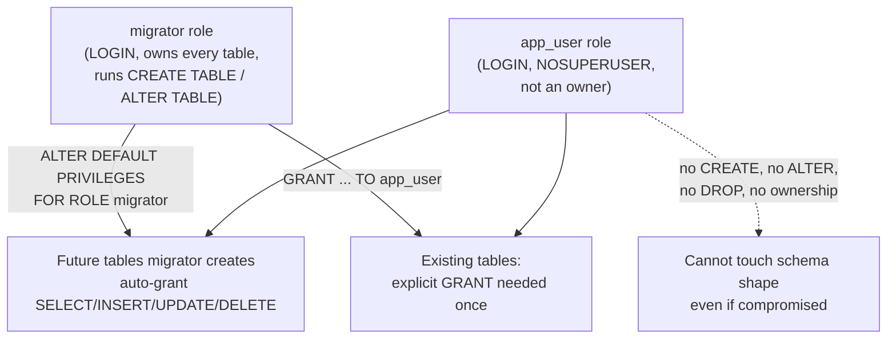

# Lesson 50. Roles and Least Privilege

**Mission link:** Lesson 49 fixed how a value reaches a statement, so a malicious string can no longer change what the statement does. It said nothing about who is allowed to run the statement at all, or what it can touch once it does. A perfectly parameterised statement, run by a role that can read and write every table in the database, still lets an application bug or a compromised credential do exactly that; this lesson is the second, independent defence.
**Primary source:** [Chapter 21. Database Roles, PostgreSQL](https://www.postgresql.org/docs/current/user-manag.html)
**Prerequisites:** [Lesson 49](0049-sql-injection-and-parameterised-statements.md)

## Warm-up

1. ▢ Per lesson 49, what does a parameterised statement protect against, and what does it say nothing about?

<details markdown="1"><summary>Check</summary>

It protects against a value changing what the statement's parsed structure means. It says nothing about which statements the role running it is even allowed to execute, or which tables that role can reach.

</details>

2. ▢ Per lesson 49, was the fix that stopped an injected value from working a property of the value itself, or of how the statement was built?

<details markdown="1"><summary>Check</summary>

Of how the statement was built: the value never entered the parsed text at all, so no value, however crafted, could change what the statement meant. This lesson asks a different question about the same statement, once it is safely parameterised: what is the role running it actually allowed to touch?

</details>

## Know this

### A role is the one concept; "user" and "group" are just how it's used

PostgreSQL versions before 8.1 had separate users and groups; now there is only the role, and any role can act as either, both, or neither. What makes a role usable to open a connection is one attribute, `LOGIN`:

```sql
CREATE ROLE app_reporting;          -- no LOGIN: cannot connect, exists to hold privileges
CREATE ROLE app_user LOGIN;         -- can connect
CREATE USER app_user;               -- exactly the same as CREATE ROLE ... LOGIN
```

`CREATE USER` is not a different kind of object; it is `CREATE ROLE` with `LOGIN` already turned on. A role created without it cannot be named as the role a connection authenticates as, but it can still own objects, be granted privileges, and be handed out as a group other roles join, which is exactly the shape a role meant only to bundle privileges together should take.

### Special attributes are never inherited; ordinary object privileges are, by default

`SUPERUSER`, `CREATEDB` and `CREATEROLE` are attributes on a role itself, and none of them pass automatically to a role that merely has membership in it: a session has to `SET ROLE` to the role carrying the attribute before it takes effect. Ordinary privileges on objects behave differently by default: PostgreSQL gives every role the `INHERIT` attribute unless told otherwise, so membership in a group role that has been `GRANT`ed `SELECT` on a table makes that `SELECT` usable immediately, with no `SET ROLE` needed. `NOINHERIT` on a member role turns this off, recovering the SQL standard's sharper line between a user and a role, at the cost of requiring an explicit `SET ROLE` before that membership's privileges do anything.

```sql
CREATE ROLE readonly_group NOLOGIN;
GRANT SELECT ON ALL TABLES IN SCHEMA public TO readonly_group;
GRANT readonly_group TO alice;      -- alice defaults to INHERIT
-- alice can now SELECT those tables in her own session, no SET ROLE required
```

### Ownership already grants every privilege, silently, from the moment an object exists

The role that creates an object is its owner, and the owner (along with a superuser) can do anything to that object with no `GRANT` needed at all; this is not a default that happens to be generous, it is what ownership *means*. The right to alter or drop an object is inherent in owning it and cannot itself be granted or revoked; the only way to remove it from a role is `ALTER TABLE ... OWNER TO` a different role entirely. Least privilege, in practice, is never about restricting the owner: it is entirely about deciding what everyone else, every role that is not the owner and not a superuser, is allowed to do, since nothing is granted to anyone else by default on a table, a column, or a sequence.

### `GRANT`/`REVOKE` on existing objects say nothing about objects created tomorrow

```sql
GRANT SELECT, INSERT, UPDATE, DELETE ON ALL TABLES IN SCHEMA public TO app_user;
```

This reaches only the tables that exist at the moment it runs. A migration that adds a table next week creates it with nothing granted to `app_user` at all, since default privileges on a table grant nothing to anyone but the owner. Fixing this ahead of time, rather than re-running a `GRANT` after every migration, is `ALTER DEFAULT PRIVILEGES`, which the manual is explicit sets privileges for objects created in the future and does not affect privileges already assigned to existing ones, two genuinely separate mechanisms rather than one command that happens to have a delayed effect:

```sql
ALTER DEFAULT PRIVILEGES FOR ROLE migrator IN SCHEMA public
    GRANT SELECT, INSERT, UPDATE, DELETE ON TABLES TO app_user;
```

This only takes effect for tables the `migrator` role itself creates from then on; a table created by a different role is unaffected by it, since default privileges are attached to the creating role, not inherited from any role it happens to be a member of.

### The least-privilege application user, assembled from the previous four facts

A production application connects as a role with `LOGIN`, without `SUPERUSER`, and, deliberately, without being the owner of the schema it reads and writes: a separate `migrator` role owns the tables and runs schema changes, while the application role holds only the specific data privileges, `SELECT`, `INSERT`, `UPDATE`, `DELETE`, granted to it, with `ALTER DEFAULT PRIVILEGES` set so a migration doesn't silently leave a new table unreachable. Splitting ownership from the application's own login role is what makes the application's blast radius the privileges it was actually granted, rather than the unlimited reach ownership would otherwise hand it for free.



## Practice

1. ▢ `CREATE ROLE reporting;` is run with no further attributes. Can an application authenticate to PostgreSQL as `reporting`?

<details markdown="1"><summary>Check</summary>

No. Without the `LOGIN` attribute, a role cannot be used as the role a connection authenticates as, even though it can still own objects and be granted privileges. It would need `CREATE ROLE reporting LOGIN;`, or `ALTER ROLE reporting LOGIN;` afterward, to connect.

</details>

2. ▢ A team runs `CREATE USER app;` then `GRANT SELECT ON ALL TABLES IN SCHEMA public TO app;`. A migration the following week adds a new table to that schema. Does `app` have `SELECT` on it without any further step?

<details markdown="1"><summary>Hint</summary>

Ask whether the `GRANT` that already ran reaches forward in time, or only reaches what existed the moment it ran.

</details>

<details markdown="1"><summary>Check</summary>

No. `GRANT ... ON ALL TABLES IN SCHEMA` only affects the tables that existed at the moment it ran; a table created afterward starts with nothing granted to anyone but its owner, regardless of what was granted on the tables that came before it. Only `ALTER DEFAULT PRIVILEGES`, set up in advance for the role that will create the table, reaches forward.

</details>

3. ▢ `app_user` created every table it currently uses, making it their owner. A security review runs `REVOKE ALL PRIVILEGES ON some_table FROM app_user;` to try to lock it down. Does `app_user` lose access?

<details markdown="1"><summary>Check</summary>

No. The right to act on an object is inherent in owning it and is not granted the way an ordinary privilege is, so it cannot be revoked the way one is either; `REVOKE` here has nothing to remove. The only way to take `app_user`'s access away is `ALTER TABLE some_table OWNER TO` a different role.

</details>

4. ▢ `readonly_group` is `NOLOGIN` and holds `SELECT` on every table in a schema. `bob` is granted membership in `readonly_group` with the default `INHERIT` attribute, and `carol` is granted the same membership but with `NOINHERIT` set on her own role. Predict whether each can run a plain `SELECT` against those tables immediately after connecting, with no other statement first.

<details markdown="1"><summary>Check</summary>

`bob` can, immediately: `INHERIT` is the default, so membership privileges apply to his session with no extra step. `carol` cannot, until she runs `SET ROLE readonly_group` first: `NOINHERIT` means her session only has her own directly granted privileges until she explicitly assumes the group role.

</details>

5. ▢ A role has been granted `SELECT`, `INSERT`, `UPDATE` and `DELETE` on every table in a schema, nothing more, and is not `SUPERUSER`. Name one thing this role still cannot do to the schema's shape, and one thing granting it `SUPERUSER` would additionally bypass that a narrower, explicit `GRANT` never does.

<details markdown="1"><summary>Check</summary>

It cannot create, alter or drop a table, add a column, or change an index, since none of those are covered by `SELECT`/`INSERT`/`UPDATE`/`DELETE`; those need `CREATE` on the schema or ownership of the object. `SUPERUSER` bypasses every permission check outright, which is a fundamentally different, much larger grant than any combination of explicit object privileges: a role built entirely from `GRANT`s can always be reasoned about object by object, while a superuser's reach has to be trusted wholesale.

</details>

## Real-world reps

- [ ] Find the role your own application connects as, and check whether it is a superuser, the owner of the tables it reads and writes, or neither.
- [ ] Run `\du` (or query `pg_roles`) against a database you have access to, and identify which roles have `LOGIN`, which have `SUPERUSER`, and which exist only to be joined by others.
- [ ] Tomorrow: set up `ALTER DEFAULT PRIVILEGES` for whichever role runs your migrations, granting your application role's ordinary privileges on tables that role will create, and confirm a newly created table already has them with no manual `GRANT` afterward.

## Going further

- [21.1. Database Roles](https://www.postgresql.org/docs/current/database-roles.html)
- [21.2. Role Attributes](https://www.postgresql.org/docs/current/role-attributes.html)
- [21.3. Role Membership](https://www.postgresql.org/docs/current/role-membership.html)
- [5.8. Privileges](https://www.postgresql.org/docs/current/ddl-priv.html)
- [ALTER DEFAULT PRIVILEGES](https://www.postgresql.org/docs/current/sql-alterdefaultprivileges.html)
- [Lesson 49. SQL Injection and Parameterised Statements](0049-sql-injection-and-parameterised-statements.md)
- [Resources](../RESOURCES.md)

---

Not landing? Reread the primary source at the top, since this lesson compresses it and compression is where understanding leaks. Check the [glossary](../GLOSSARY.md) for any term that felt slippery.

If the lesson itself is unclear rather than the material, that is a defect: [open an issue](https://github.com/TokenCemetery/teach/issues).
