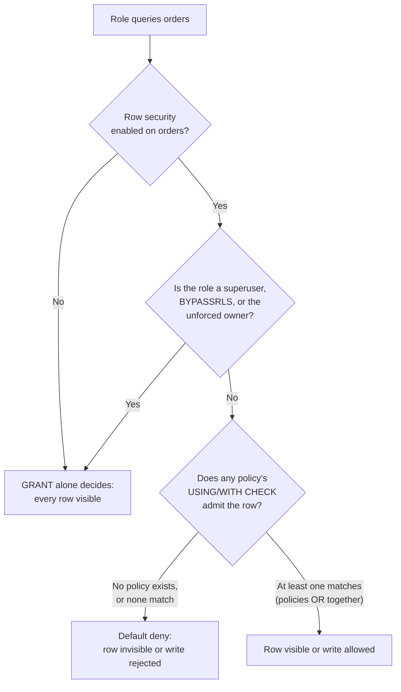

# Lesson 51. Row-Level Security

**Mission link:** Lesson 50 showed `GRANT` deciding access at the level of a whole table: a role either has `SELECT` on `orders` or it doesn't, with no way to say "only its own rows" inside that grant. An application that wants per-customer isolation usually bolts a `WHERE customer_id = ...` onto every query instead, a filter that has to be remembered at every call site and is silently absent from the one nobody thought to add it to. A row security policy is the same restriction enforced by the engine itself, on every access path that reaches the table under that role, not only the ones a developer remembered.
**Primary source:** [5.9. Row Security Policies, PostgreSQL](https://www.postgresql.org/docs/current/ddl-rowsecurity.html)
**Prerequisites:** [Lesson 50](0050-roles-and-least-privilege.md)

## Warm-up

1. ▢ Per lesson 50, once a role has been granted `SELECT` on a table, how many of the table's rows can it see?

<details markdown="1"><summary>Check</summary>

All of them. `GRANT` is a per-object, per-privilege decision with no concept of "some rows but not others"; a role with table-level `SELECT` sees every row that exists.

</details>

2. ▢ Per lesson 50, is a table's owner subject to the privileges granted to other roles, or exempt from needing them?

<details markdown="1"><summary>Check</summary>

Exempt. The owner can act on the object in every way with no `GRANT` needed at all, from the moment it exists; ownership already implies full access. This lesson asks whether that same exemption also applies to a policy layered on top of `GRANT`.

</details>

## Know this

### Row security is a second, independent layer, disabled by default

`GRANT` is the SQL-standard privilege system; row security is described as being "in addition to" it, a separate check applied per row rather than per table. By default a table has no policies at all, so a role with table-level `SELECT` sees every row exactly as lesson 50 described. `ALTER TABLE ... ENABLE ROW LEVEL SECURITY` changes the default for that table from "every row the privilege system allows" to default-deny: once enabled, if no policy exists yet, no rows are visible or modifiable to anyone but the exempt roles this lesson gets to later, regardless of what `GRANT` already allows.

```sql
ALTER TABLE orders ENABLE ROW LEVEL SECURITY;
-- with no CREATE POLICY yet: app_user, despite having GRANT SELECT, sees zero rows
```

### `CREATE POLICY` names a condition, and `USING` and `WITH CHECK` answer two different questions

```sql
CREATE POLICY customer_isolation ON orders
    USING (customer_id = current_setting('app.current_customer_id')::int);
```

`USING` decides which existing rows a command can see or touch: it governs a `SELECT`, the old row an `UPDATE` or `DELETE` targets. `WITH CHECK` decides whether a row being written, a new `INSERT` or the new version an `UPDATE` produces, is allowed to exist at all; if a policy gives only `USING`, that same expression is reused as the `WITH CHECK` as well, which is why the policy above blocks both reading another customer's orders and creating or retargeting a row so it would belong to one.

### Two policies on the same command combine permissively, with `OR`

```sql
CREATE POLICY view_all ON orders
    FOR SELECT
    USING (true);
CREATE POLICY modify_own ON orders
    USING (customer_id = current_setting('app.current_customer_id')::int);
```

For a `SELECT`, both policies apply and are combined with `OR`, so `true` from the first one means every row is visible regardless of the second policy's narrower condition. For an `UPDATE` or a `DELETE`, only `modify_own` applies, since the first policy was scoped to `FOR SELECT` alone, so those commands are still confined to the caller's own rows. This is the mechanism, not a special case: adding a policy can only ever widen what a command is allowed to touch for a given role, never narrow what an existing, separately-matching policy already permitted.

### Superusers, `BYPASSRLS` roles, and the owner all bypass a policy by default

Superusers and any role carrying the `BYPASSRLS` attribute bypass row security entirely, on every table, regardless of any policy. The table's owner bypasses it too, by default, which is the detail that connects directly to lesson 50's split: a role that owns the table it also queries as the application gets every row anyway, no policy applied, because ownership already implies access and row security does not revoke what ownership grants unless told to. `ALTER TABLE ... FORCE ROW LEVEL SECURITY` is what makes an owner subject to its own table's policies, an opt-in most tables never need because the working application role, per lesson 50, was never the owner to begin with.



### What an engine-enforced policy buys over a hand-added filter

A `WHERE customer_id = ...` written into an application's query has to be present in every query that reaches the table: a new report, an ad hoc `psql` session using the same credentials, a join that pulls `orders` in through a different code path, each one is a fresh chance to leave it out, and leaving it out fails silently, returning rows rather than an error. A row security policy is checked by the engine itself on every one of those paths, under that role, with nothing for a developer to remember to add; the only way around it is being one of the roles this lesson just named as exempt, which is a short, auditable list rather than every call site in a codebase.

## Practice

1. ▢ `orders` has `GRANT SELECT` given to `app_user`, and row security has never been enabled on it. Predict how many rows a query run as `app_user` returns.

<details markdown="1"><summary>Check</summary>

All rows the query would otherwise match, exactly as lesson 50 described: with row security not enabled, `GRANT` alone decides access, and it has no concept of restricting which rows within a table a granted role can see.

</details>

2. ▢ `ALTER TABLE orders ENABLE ROW LEVEL SECURITY;` is run, and no `CREATE POLICY` has been added yet. `app_user` still has `GRANT SELECT` from before. Predict what a `SELECT * FROM orders` run as `app_user` now returns.

<details markdown="1"><summary>Hint</summary>

Ask what the default is once row security is enabled and no policy exists to override it.

</details>

<details markdown="1"><summary>Check</summary>

Zero rows. Enabling row security with no policy in place is default-deny: the existing `GRANT SELECT` is necessary but no longer sufficient, since every row now also needs a policy to admit it, and none exists yet.

</details>

3. ▢ Two policies apply to `SELECT` on the same table for the same role: one reads `USING (true)`, the other reads `USING (region = current_setting('app.region'))`. How many rows does a `SELECT` see?

<details markdown="1"><summary>Check</summary>

Every row. Multiple policies matching the same command combine with `OR`, so the unconditionally true policy alone admits every row regardless of what the narrower, region-scoped policy would have allowed on its own.

</details>

4. ▢ `app_user` is both the role the application connects as and the owner of `orders`, having skipped lesson 50's split between an owning `migrator` role and a non-owning application role. Row security is enabled and a restrictive policy is created. Does the policy restrict what `app_user` itself can see?

<details markdown="1"><summary>Check</summary>

No, not by default. A table's owner bypasses row security unless the table was altered with `FORCE ROW LEVEL SECURITY`; an application role that is also the table's owner gets every row regardless of any policy, which is exactly the scenario lesson 50's ownership/application split exists to avoid.

</details>

5. ▢ A policy is written as `CREATE POLICY p ON orders USING (customer_id = current_setting('app.current_customer_id')::int);`, with no separate `WITH CHECK` clause. Does an `INSERT` of a row for a different `customer_id` succeed?

<details markdown="1"><summary>Check</summary>

No. A policy with only a `USING` clause reuses that same expression as its `WITH CHECK`, so a new row that would fail the `USING` condition also fails the check applied to rows being written, blocking the `INSERT` exactly as it would block seeing an existing mismatched row.

</details>

## Real-world reps

- [ ] Enable row security on one table you control, create a policy scoping it to a value like the current user or a tenant id, and confirm a role with table-level `GRANT` still sees nothing until the policy is added.
- [ ] Write a policy with a `USING` clause narrower than its intended `WITH CHECK`, or vice versa, by specifying both explicitly, and confirm reading and writing are governed independently.
- [ ] Tomorrow: check whether any role your application connects as is also the owner of the tables it queries, and if so, confirm whether `FORCE ROW LEVEL SECURITY` is set on them.

## Going further

- [5.9. Row Security Policies](https://www.postgresql.org/docs/current/ddl-rowsecurity.html)
- [CREATE POLICY](https://www.postgresql.org/docs/current/sql-createpolicy.html)
- [Lesson 50. Roles and Least Privilege](0050-roles-and-least-privilege.md)
- [Resources](../RESOURCES.md)

---

Not landing? Reread the primary source at the top, since this lesson compresses it and compression is where understanding leaks. Check the [glossary](../GLOSSARY.md) for any term that felt slippery.

If the lesson itself is unclear rather than the material, that is a defect: [open an issue](https://github.com/TokenCemetery/teach/issues).
