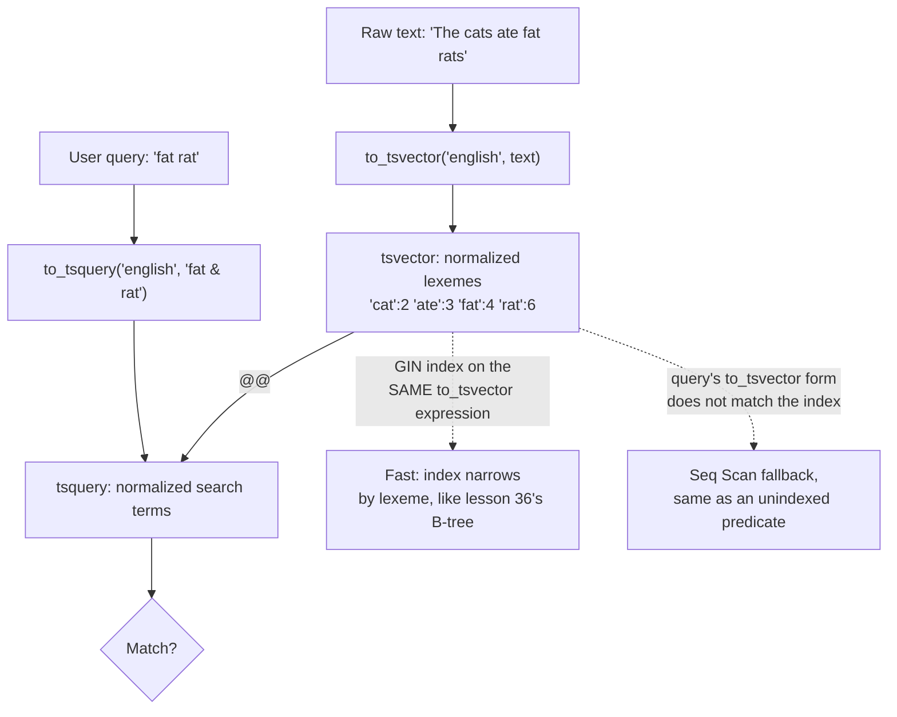

# Lesson 52. Full-Text Search

**Mission link:** Lesson 36 showed a B-tree turning a scan of every row into a walk down a few pages, for an equality or a range. `LIKE '%word%'` cannot be sped up the same way, since a leading wildcard gives a B-tree nothing to walk toward, and it has no idea that "satisfies" and "satisfy" are the same word to a reader. Full text search is not a faster `LIKE`; it is a different representation of the text, built specifically so an index can help.
**Primary source:** [12.1. Introduction, PostgreSQL Full Text Search](https://www.postgresql.org/docs/current/textsearch-intro.html)
**Prerequisites:** [Lesson 36](0036-what-an-index-does.md)

## Warm-up

1. ▢ Per lesson 36, what did building an index change about a table's rows, and what did it never change?

<details markdown="1"><summary>Check</summary>

It changed how a matching row is found, a walk down a few pages instead of a read of the whole table. It never changed the rows themselves, or how many of them exist; this lesson asks what has to change about the *text itself* before an index can help with a word inside it.

</details>

2. ▢ Per lesson 36, which of the four ways a plan reads a table is the fallback when nothing narrows a search? What does that node report about the rows it discarded?

<details markdown="1"><summary>Check</summary>

`Seq Scan`, reading every page in physical order; it reports `Rows Removed by Filter`, the count of rows read and thrown away. A `LIKE '%word%'` predicate falls back to exactly this, for the same reason an unindexed equality did.

</details>

## Know this

### `LIKE`, `ILIKE` and regex lack what a search actually needs

The primary source is direct about this: these operators have no linguistic support, so a search for `satisfy` misses `satisfies` unless every derived form is spelled out with `OR`, tedious and error-prone since some words have thousands of derivatives. They provide no ranking, so thousands of matches come back in no useful order. And they are slow, since nothing about a leading-wildcard pattern narrows a search the way an equality does, leaving a full scan as the only option regardless of any index sitting nearby. Full text search exists to fix all three at once, not merely the speed.

### `tsvector` reduces a document to normalized lexemes

```sql
SELECT to_tsvector('english', 'The cats ate fat rats');
--  'ate':3 'cat':2 'fat':4 'rat':6
```

`to_tsvector` parses the text and reduces each word to a lexeme: `cats` becomes `cat`, `rats` becomes `rat`, stripped of the ending that made them plural, with a position recorded for each. This is why the primary source can say lexemes are "assumed already normalized": a `tsvector` is not the original text stored differently, it is a compact, linguistically reduced representation built once so that searching and ranking never have to touch the raw string again until a matched row is chosen for display.

### `tsquery` and `@@` ask whether those lexemes are present

```sql
SELECT to_tsvector('fat cats ate fat rats') @@ to_tsquery('fat & rat');
-- t
```

`to_tsquery` normalizes its own input the same way, so `rat` in the query matches `rat` in the document even though the document held `rats`; a raw string on either side of `@@` would have missed this entirely. `&`, `|` and `!` combine terms as AND, OR and NOT, and `<->` (FOLLOWED BY) matches only when two terms are adjacent and in order, which is how a phrase search is expressed rather than by matching a whole substring.

### A GIN index is what makes `@@` fast, and it has to match exactly how the query is written

```sql
CREATE INDEX pgweb_idx ON pgweb USING GIN (to_tsvector('english', body));
```

A GIN (Generalized Inverted Index) holds one entry per lexeme with a compressed list of the rows containing it, so a multi-word search finds the first term's matches, then narrows using the index rather than rereading every row, the same principle lesson 36 already established for an ordinary B-tree. The two-argument form of `to_tsvector`, with the configuration named explicitly, is required in the index because the index's contents must not depend on a session setting like `default_text_search_config` that could differ later. This has a sharp consequence: a query written as `to_tsvector(body) @@ ...`, the one-argument form, does not match the indexed expression at all, and the planner falls back to a `Seq Scan`, silently, exactly the fallback lesson 36 already showed for an unindexed predicate, with nothing but the plan itself revealing that the index was never used.

GiST is the second option, usable on both `tsvector` and `tsquery`, but it is lossy: it can produce a false match, so the actual row still has to be rechecked, and GIN is preferred wherever the update rate allows it, since GIN pays more on write and less on every read that follows.

### The boundary with a dedicated search engine

What full text search inside the database buys is staying in one system: search results come from the same transaction as everything else, with no second store to keep in sync and no window where the two disagree. That advantage stops being the deciding factor once the requirements shift to what this feature was never built for: fuzzy, typo-tolerant matching across several languages in the same query, faceted search combined with relevance ranking at a scale of many millions of documents, or scaling the search workload independently of the transactional one. The tell is the read pattern itself outgrowing what one GIN index on one instance can serve, not a fixed document count; a system that has actually hit that ceiling is choosing Elasticsearch or OpenSearch for reasons this lesson's `tsvector`/`tsquery` pair does not attempt to solve.



## Practice

1. ▢ Predict the result of `SELECT to_tsvector('english', 'The cats are running') @@ to_tsquery('english', 'cat & run');`.

<details markdown="1"><summary>Check</summary>

`t` (true). `cats` reduces to the lexeme `cat` and `running` reduces to `run`; both appear in the document's `tsvector`, and the query asks for both with `&`, so the match succeeds even though neither word appears in the document in the exact form the query used.

</details>

2. ▢ A table has `CREATE INDEX idx ON docs USING GIN (to_tsvector('english', body));`. A query runs `WHERE to_tsvector(body) @@ to_tsquery('foo')`, using the one-argument form of `to_tsvector`. Does this query use the index?

<details markdown="1"><summary>Hint</summary>

Ask whether the expression the query wrote is textually the same expression the index was built on.

</details>

<details markdown="1"><summary>Check</summary>

No. The index was built on the two-argument expression `to_tsvector('english', body)`; a query using the one-argument form is a different expression as far as the planner is concerned, since the one-argument form's result can vary with `default_text_search_config`. The query falls back to a `Seq Scan`, exactly as an unindexed predicate would.

</details>

3. ▢ A search for the word `satisfy` is run two ways: `WHERE body LIKE '%satisfy%'` and `WHERE to_tsvector(body) @@ to_tsquery('satisfy')`. A row contains only the word `satisfies`. Predict whether each finds it.

<details markdown="1"><summary>Check</summary>

The `LIKE` form does not, since `satisfies` does not contain the literal substring `satisfy` followed immediately by nothing else matching the pattern's edges correctly for every case, and more generally `LIKE` has no notion that the two words share a root at all. The full text search form does, since `satisfies` and `satisfy` reduce to the same normalized lexeme, which is exactly the linguistic support the primary source names `LIKE` as lacking.

</details>

4. ▢ Between a GIN index and a GiST index on the same `tsvector` column, which one requires the actual table row to be rechecked after the index reports a candidate match, and why?

<details markdown="1"><summary>Check</summary>

GiST, because it is lossy: it can report a false match, so the row has to be read and rechecked to confirm it. GIN stores the lexemes themselves rather than a lossy signature, so a plain word match needs no recheck, though a query involving weights still needs one since GIN does not store weight labels.

</details>

5. ▢ A product search needs typo-tolerant matching across five languages simultaneously, faceted filters combined with relevance ranking, and ten million documents. Per this lesson's own boundary, is `tsvector`/`tsquery` still the right tool, or the sign to reach for a dedicated search engine?

<details markdown="1"><summary>Check</summary>

The sign to reach for a dedicated search engine. Typo tolerance, multi-language matching in one query, and faceted ranking at that scale are exactly the requirements this lesson named as outside what `tsvector`/`tsquery` were built for; the boundary is the read pattern outgrowing what one GIN index can serve, and this is that pattern.

</details>

## Real-world reps

- [ ] Add a `tsvector` column or expression index to a text column you have access to, and confirm with `EXPLAIN` that a `@@` query against it uses the GIN index rather than a `Seq Scan`.
- [ ] Run the same search two ways, once with `LIKE '%word%'` and once with `to_tsvector(...) @@ to_tsquery(...)`, against a table containing a plural or a derived form of that word, and compare which one finds it.
- [ ] Tomorrow: check whether a query against your `tsvector` index uses the same argument form, configuration included, as the expression the index was built on, by reading the plan rather than assuming it.

## Going further

- [12.1. Introduction](https://www.postgresql.org/docs/current/textsearch-intro.html)
- [12.2. Tables and Indexes](https://www.postgresql.org/docs/current/textsearch-tables.html)
- [12.9. Preferred Index Types for Text Search](https://www.postgresql.org/docs/current/textsearch-indexes.html)
- [Lesson 36. What an Index Actually Does](0036-what-an-index-does.md)
- [Resources](../RESOURCES.md)

---

Not landing? Reread the primary source at the top, since this lesson compresses it and compression is where understanding leaks. Check the [glossary](../GLOSSARY.md) for any term that felt slippery.

If the lesson itself is unclear rather than the material, that is a defect: [open an issue](https://github.com/TokenCemetery/teach/issues).
