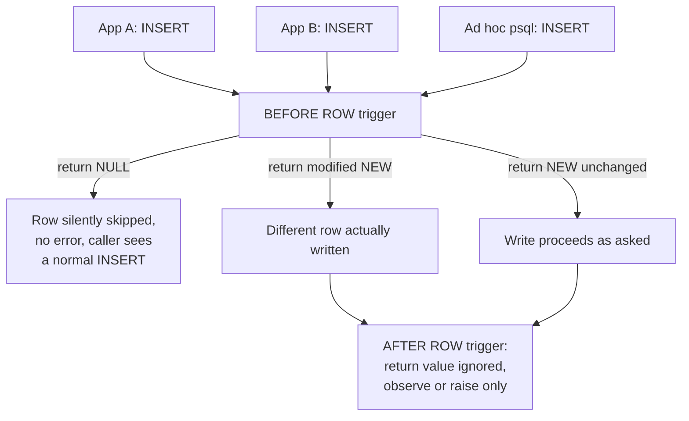

# Lesson 53. Triggers, Stored Procedures, and Where Logic Belongs

**Mission link:** This is stage 8's capstone. Lesson 26 reached for a trigger to keep a denormalised count correct and said writing one well was not that lesson's subject; this is where that promise is kept. Lesson 49 fixed how a value reaches a statement, lesson 50 decided who may run it, and lesson 51 restricted which rows it can touch, each enforced by the engine on every path that reaches a table, not the one path an application remembered to check. A trigger is the same guarantee generalised to arbitrary logic; a stored procedure is the other structure this stage owes a review of, since it gets something a function categorically does not: control over its own transaction.
**Primary source:** [37.1. Overview of Trigger Behavior, PostgreSQL](https://www.postgresql.org/docs/current/trigger-definition.html)
**Prerequisites:** [Lesson 26](0026-denormalising-on-purpose.md), [Lesson 51](0051-row-level-security.md)

## Warm-up

1. ▢ Per lesson 26, why could a `CHECK` constraint not keep `child_count` correct on its own, and what did the lesson reach for instead?

<details markdown="1"><summary>Check</summary>

A `CHECK` bounds a single value against a rule about that row alone; it cannot verify that a count matches what the rows in a different table actually add up to, since that comparison reaches outside the row it's attached to. The lesson reached for a trigger, one that watches writes to the child table and keeps the parent's count in step.

</details>

2. ▢ Per lesson 51, what makes a row security policy stronger than a `WHERE` clause an application adds by hand?

<details markdown="1"><summary>Check</summary>

The policy is checked by the engine on every access path under a role, not only the ones a developer remembered to filter. This lesson asks the same question about arbitrary logic rather than about which rows are visible.

</details>

## Know this

### A trigger runs on every path that reaches the table, not the one a caller happened to use

```sql
CREATE TRIGGER stamp_updated_at
    BEFORE UPDATE ON orders
    FOR EACH ROW
    EXECUTE FUNCTION set_updated_at();
```

`BEFORE`, `AFTER` or `INSTEAD OF` names when it fires relative to the write; `FOR EACH ROW` or `FOR EACH STATEMENT` names how many times: a row-level trigger runs once per affected row, a statement-level trigger once per statement regardless of how many rows it touched. This matters concretely for `TRUNCATE`, which a row-level trigger never sees at all, since nothing is touched "per row" by a statement that empties a table in one step; only a statement-level trigger can watch for it. Whichever application, migration script, or ad hoc `psql` session issues the `UPDATE`, this trigger runs, which is the same property lesson 51's policy had: enforced by the engine on the path, not remembered by the caller.

### `NEW`, `OLD`, and what returning `NULL` from a `BEFORE` row trigger actually does

A row-level trigger function receives `NEW`, the proposed row, for `INSERT`/`UPDATE`, and `OLD`, the existing row, for `UPDATE`/`DELETE`. A `BEFORE` row trigger can return `NULL`, which instructs the executor not to perform the row-level operation at all, silently and without an error, exactly as if that one row had never been submitted. It can instead return a modified `NEW`, which becomes what is actually inserted or written, letting the trigger change data the caller never asked to have changed. An `AFTER` row trigger's return value is always ignored, since by the time it runs the write already happened; it can only observe what was written, or abort the entire operation by raising an error, never quietly alter it.



### A stored procedure gets one thing a function never does: its own transaction control

`CREATE PROCEDURE` has no `RETURNS` clause; a procedure returns nothing directly, though it may use `OUT` parameters, and it is invoked in isolation with `CALL`, never as part of a query the way a function is. The difference worth a review's attention: a procedure can `COMMIT` or `ROLLBACK` during its own execution, automatically starting a new transaction afterward, as long as the invoking `CALL` is not itself already inside an explicit transaction block. A function cannot do this under any circumstance.

```sql
CALL do_batch_cleanup();   -- may commit partway through, invisibly to the caller
```

A caller that wraps this in its own `BEGIN ... CALL do_batch_cleanup(); ... COMMIT;` changes the outcome entirely: a `COMMIT` inside the procedure is then an error, since the procedure is not permitted to end a transaction it did not start.

### Reviewing one: the questions each earns just by being invisible

A trigger or a procedure runs without appearing anywhere in the application's own diff, precisely lesson 47's point about an ORM's generated SQL, applied here to logic instead of statements: the only way to know what actually happens is to look at the object itself, not at the code that triggered it. For a trigger: what is its timing and level, does it ever return `NULL` or a modified `NEW` under some condition, and does it fire on every operation a reviewer assumes, `TRUNCATE` included. For a procedure: does it commit or roll back internally, and would every caller know that a bare `CALL` might leave a transaction already committed, or already rolled back, underneath code that assumed it was still open.

### The stage capstone: when logic actually belongs at this layer

Every lesson in this stage has been one argument, restated once per mechanism. Parameterisation fixed how a value reaches a statement, at the engine, not case by case in application code. `GRANT` and roles decided access at the engine, not by trusting every caller to check first. Row security restricted which rows are visible on every path, not the one a developer remembered to filter. A trigger or a procedure closes the same loop around arbitrary logic: it earns its place exactly when a rule has to hold regardless of which caller reaches the table, the identical question this whole stage has asked of every mechanism in it. Lesson 26's `child_count` trigger passed that test, since a `CHECK` genuinely cannot verify a cross-row invariant, only bound one row's own value. A rule that only one application's own code path actually needs does not pass it: reaching for a trigger there buys nothing but the cost this lesson just spent five sections naming, invisibility to a review of the very code that triggers it.

## Practice

1. ▢ A `BEFORE` row-level trigger on `orders` returns `NULL` under a condition, and raises no error when it does. Predict what a caller running `INSERT INTO orders ...` observes when that condition holds.

<details markdown="1"><summary>Hint</summary>

Ask whether "no error" and "the row was written" are the same fact.

</details>

<details markdown="1"><summary>Check</summary>

The `INSERT` reports success, with no error and no warning, but the row is not written at all; a `BEFORE` row trigger returning `NULL` skips the row-level operation silently. A caller has no way to detect this from the statement's own result alone.

</details>

2. ▢ An `AFTER` row-level trigger on `orders` modifies `NEW` inside its function body, attempting to change a column's value. Does this change what gets stored?

<details markdown="1"><summary>Check</summary>

No. An `AFTER` trigger's return value is always ignored, because the write already happened before it ran; whatever it does to a copy of `NEW` inside its own function body has no effect on the row that was actually written. Only a `BEFORE` trigger can change what gets written.

</details>

3. ▢ A procedure's body executes `COMMIT` partway through. Predict the outcome if the caller invokes it as a bare `CALL do_batch();` at the top level, then predict the outcome if the caller instead runs `BEGIN; CALL do_batch(); COMMIT;`.

<details markdown="1"><summary>Check</summary>

The bare `CALL` succeeds: the procedure commits its own work partway through and automatically begins a new transaction to finish in. Wrapped inside the caller's own explicit `BEGIN`, the same internal `COMMIT` fails, since the procedure would then be trying to end a transaction it did not start, which is exactly what the invoking-`CALL`-not-in-a-transaction-block condition excludes.

</details>

4. ▢ A reviewer reads a diff containing only an ordinary `INSERT INTO orders (...) VALUES (...)`. A `BEFORE` trigger already installed on `orders` silently rewrites `customer_id` under some condition unrelated to anything in the diff. Can the reviewer discover this from the diff alone?

<details markdown="1"><summary>Check</summary>

No. Nothing in an `INSERT` statement's own text reveals what a trigger on the target table might do to it; the diff shows only what was asked for, not what a `BEFORE` trigger elsewhere might rewrite it into. The reviewer would need to separately check what triggers exist on `orders` and read their bodies, not the calling code.

</details>

5. ▢ **Stage capstone.** A team wants "an order's stored total must always equal the sum of its line items," enforced no matter which of three separate services writes to `orders` and `order_lines`. Using this stage's own recurring question, decide between an application-side check, a `CHECK` constraint, and a trigger, and justify the choice by naming what the runner-up mechanism cannot do.

<details markdown="1"><summary>Check</summary>

A trigger. The rule has to hold regardless of which of three services writes the rows, the exact test this stage has applied to every mechanism in it; an application-side check only protects the one service that remembers to run it, precisely the gap parameterisation, roles and row security each closed by moving enforcement to the engine. A `CHECK` constraint cannot do it either, for lesson 26's own reason: the total lives on `orders` while the line items live in a different table, and a `CHECK` can only see the row it's attached to, never add up rows somewhere else. Only a trigger, watching writes to `order_lines` and keeping `orders`'s stored total in step, reaches across both tables the way the rule actually requires.

</details>

## Real-world reps

- [ ] Find one trigger in a database you have access to; determine its timing (`BEFORE`/`AFTER`/`INSTEAD OF`) and level (`ROW`/`STATEMENT`), and check whether it can silently skip or rewrite a row.
- [ ] Find, or write, one stored procedure and check whether it commits or rolls back its own transaction internally, and confirm whether every caller of it actually knows that.
- [ ] Tomorrow: apply this stage's recurring question, does this rule have to hold regardless of which caller reaches the table, to one rule your own team currently enforces only in application code, and decide honestly whether it belongs there or at the database layer instead.

## Going further

- [37.1. Overview of Trigger Behavior](https://www.postgresql.org/docs/current/trigger-definition.html)
- [41.10. Trigger Functions](https://www.postgresql.org/docs/current/plpgsql-trigger.html)
- [36.4. User-Defined Procedures](https://www.postgresql.org/docs/current/xproc.html)
- [CREATE PROCEDURE](https://www.postgresql.org/docs/current/sql-createprocedure.html)
- [Lesson 26. Denormalising on Purpose](0026-denormalising-on-purpose.md)
- [Lesson 51. Row-Level Security](0051-row-level-security.md)
- [Resources](../RESOURCES.md)

---

Not landing? Reread the primary source at the top, since this lesson compresses it and compression is where understanding leaks. Check the [glossary](../GLOSSARY.md) for any term that felt slippery.

If the lesson itself is unclear rather than the material, that is a defect: [open an issue](https://github.com/TokenCemetery/teach/issues).
