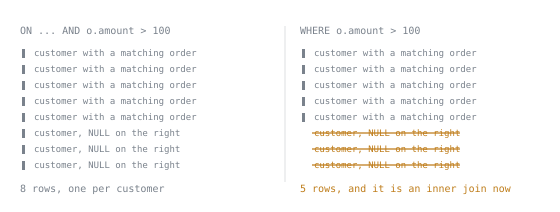

# Querying

Lookup sheet for stage 2. The question it exists to answer: **which join, subquery or set operation answers this question, and where does a condition belong?**

All counts below are against the small fixture: eight customers, twelve orders, eight countries, described in [The Dataset](the-dataset.md).

## Every join type

| Join | Keeps | Invents | Verified count |
|---|---|---|---|
| `CROSS JOIN` | every pairing of both tables, no condition | nothing | `customers CROSS JOIN orders`: 96 |
| `JOIN` / `INNER JOIN` | only pairs where the condition is true | nothing | `customers JOIN orders ON c.id = o.customer_id`: 12 |
| `LEFT JOIN` | every left row, matched or not | `NULL` for every right-hand column when nothing matched | `customers LEFT JOIN orders`: 13 |
| `RIGHT JOIN` | every right row, matched or not; `LEFT JOIN` with sides swapped | `NULL` for every left-hand column when nothing matched | `customers RIGHT JOIN countries ON n.code = c.country`: 10 |
| `FULL JOIN` | every row from both sides | `NULL` on whichever side failed to match | `customers FULL JOIN countries ON n.code = c.country`: 13 |
| `NATURAL JOIN` | guesses the shared column names instead of naming them; a trap, not a shortcut | nothing, but silently changes what the condition means | `customers NATURAL JOIN orders` (guesses `id = id`): 0. `orders NATURAL JOIN countries` (no shared column, degrades to a cross product): 96 |

A `RIGHT JOIN` is never a distinct operation: swapping which table is named first and writing `LEFT JOIN` instead gives the identical rows, and reads in the direction everyone already scans `FROM` in.

## ON versus WHERE

For an inner join the two are interchangeable: `customers, orders WHERE customers.id = orders.customer_id` and `customers JOIN orders ON c.id = o.customer_id` both return 12. The equivalence breaks once a join can invent a row.

| Where the condition sits | Effect |
|---|---|
| `ON`, on the outer table's own columns | decides what counts as a match, before the row is invented; a customer matching nothing still appears once, with `NULL`s |
| `WHERE`, after a `LEFT`/`RIGHT`/`FULL JOIN` | filters the already-built result; a real comparison against an invented `NULL` evaluates to unknown and drops the row, quietly turning the outer join back into an inner one |

Verified on `customers LEFT JOIN orders ON o.customer_id = c.id`: adding `WHERE o.amount > 100` gives 5 rows; moving the identical condition into `ON ... AND o.amount > 100` gives 8, one per customer. The one safe test to run in `WHERE` after an outer join is `IS NULL` on the invented side, since `IS NULL` never returns unknown: that idiom is the anti-join, `WHERE o.id IS NULL` after `customers LEFT JOIN orders`, isolating customer 6 alone.

## What each aggregate does with NULL

Every aggregate except `count(*)` ignores `NULL`: it is treated as absent from the calculation, not as zero.

| Aggregate | A `NULL` in the column | Over zero rows |
|---|---|---|
| `count(*)` | irrelevant, it counts rows | `0` |
| `count(column)` | skipped | `0` |
| `count(DISTINCT column)` | skipped | `0` |
| `sum(column)` | skipped | `NULL` |
| `avg(column)` | skipped, and the divisor is the count of values seen, not the row count | `NULL` |

Verified on `orders` (12 rows, `shipped_at` missing on four): `count(*)` 12, `count(shipped_at)` 8, `sum(amount)` 2406.49, `avg(amount)` 200.5408333333333333. Verified with `WHERE amount > 100000` (zero rows survive): `count(*)` 0, `sum(amount)` and `avg(amount)` both `NULL`. `coalesce(sum(amount), 0)` turns that blank into a `0` a caller can print without it reading as a failed query.

`GROUP BY` treats `NULL` differently from `WHERE` and a join condition: `WHERE country = 'GB'` and a join's `ON` both refuse to match a `NULL`, but `GROUP BY` puts every `NULL` into one group rather than dropping the rows, since grouping only needs somewhere to put a row it cannot compare. Verified: `customers JOIN orders GROUP BY c.country` gives five groups, not four, the fifth holding both `NULL`-country customers with 2 orders and 700.00.

## Where a condition belongs

Tied to [Evaluation order](select-evaluation-order.md): `ON` and `FROM` run first, `WHERE` second, `GROUP BY` third, `HAVING` fourth, then `SELECT`.

| Clause | Runs | Sees | Put here |
|---|---|---|---|
| `ON` | while the join builds its rows | both sides of that one join | a condition on how two rows relate, including the outer table's own columns when a `NULL` row must not be invented for the wrong reason |
| `WHERE` | one row at a time, before grouping | a row's own columns; no aggregate, no `SELECT` alias | a condition on a single row |
| `HAVING` | one group at a time, after grouping | grouped columns and aggregate results | a condition on a whole group, usually an aggregate |
| `FILTER (WHERE ...)` | attached to one aggregate call | restricts only what that call sees | a per-aggregate row condition, when different aggregates in the same query need different rows |

`HAVING` needs no `GROUP BY`: with none, the whole table is one group, and `HAVING` can still reject it. Verified: `SELECT count(*) FROM orders HAVING count(*) > 5` returns 12; the same query with `> 500` returns no rows at all, not a row holding `0`, the one way an aggregate query with no rows can come back empty.

## The diagnostics of the stage

Every error a lesson quoted, re-run and confirmed.

| Error | SQLSTATE | Cause |
|---|---|---|
| `column reference "id" is ambiguous` | `42702` | both sides of a join have a column of that name; qualify it with the table's alias |
| `column "x" must appear in the GROUP BY clause or be used in an aggregate function` | `42803` | the column is neither grouped nor aggregated, and does not follow functionally from a grouped primary key; fires the same way whether the column sits in `SELECT` or in `HAVING` |
| `aggregate functions are not allowed in WHERE` | `42803` | `WHERE` runs before `GROUP BY` exists, so no aggregate has a set of rows to work over yet |
| `aggregate function calls cannot be nested` | `42803` | an aggregate consumes a set of rows and produces one scalar; there is nothing left resembling a set for an outer aggregate to consume |
| `more than one row returned by a subquery used as an expression` | `21000` | a scalar subquery must return exactly one row; this one returned several. A runtime failure, not caught by review or by testing against data that happens to have one row |
| `each UNION query must have the same number of columns` | `42601` | set operators match columns by position; the same wording appears with `INTERSECT` or `EXCEPT` in place of `UNION` |
| `UNION types bigint and text cannot be matched` | `42804` | the column counts match but a position has no common type between the two branches |
| `syntax error at or near "UNION"` | `42601` | an `ORDER BY` was written inside one branch; only a parenthesised branch or a trailing `ORDER BY` after the last branch is legal |

All four `42803` errors share one SQLSTATE: a clause was given something it cannot have yet at the point it runs.

## Which subquery form answers which question

| Form | Question | Note |
|---|---|---|
| Scalar subquery | "give me the one value to compare against" | must return exactly one row, or `21000` at runtime, verified above |
| `IN` / `EXISTS` (a semi-join) | "does at least one match exist" | returns the outer row at most once; a join asking the same question needs an explicit `GROUP BY` or `DISTINCT` to avoid returning it once per match. Verified: customers with an order over 50, by `IN` or `EXISTS`, 6 rows; the equivalent join with no `GROUP BY`, 7 rows, `count(DISTINCT c.id)` 6 |
| Correlated subquery | "one answer per outer row" | re-scans the inner table once per outer row; reach for a join with `GROUP BY` when the whole table needs the number, not just one row |
| Derived table (subquery in `FROM`) | "treat this computed result as a table" | needs an alias in PostgreSQL 15 and earlier; PostgreSQL 16 onward accepts none, verified: `SELECT count(*) FROM (SELECT * FROM orders WHERE amount > 100)` returns 5 with no alias at all. Write the alias regardless, since older code always has one |

**The `NOT IN` and `NULL` rule.** `NOT IN` expands to a chain of `<>` joined by `AND`; one `NULL` anywhere in the subquery's result makes that chain unknown for every row, not just the row connected to the `NULL`, so `WHERE` keeps nothing. Verified: `id NOT IN (SELECT customer_id FROM orders)` returns customer 6, correctly, since `customer_id` is `NOT NULL`. Add one `NULL` to the same set, `... UNION SELECT NULL`, and the identical query returns zero rows. `NOT EXISTS` asks a different question, whether a matching row exists, and never expands into a comparison against every value, so it returns customer 6 either way. Default to `NOT EXISTS`; use `NOT IN` only against a column verified `NOT NULL`, never one merely assumed to be.

## The four set operations

Over `orders`, one branch for `amount > 100`, one for `shipped_at IS NULL`:

| Operator | Duplicates | Verified count |
|---|---|---|
| `UNION` | removed | 8 |
| `UNION ALL` | kept | 9 |
| `INTERSECT` | removed | 1 |
| `EXCEPT` | removed | 4 |

An `ALL` variant exists for every operator except plain `UNION`, which already has `UNION ALL` as its counterpart, and keeps a row exactly as many times as it was produced: `amount FROM orders WHERE customer_id = 4 EXCEPT amount FROM orders WHERE customer_id = 999` returns 2 rows, since the plain form deduplicates a genuine repeated `10.00`; the `EXCEPT ALL` form of the identical query returns 3.

Columns match by position, not by name: the output header comes entirely from the first branch. `ORDER BY` cannot sit inside an unparenthesised branch, only after the last branch, where it orders the combined result, or inside a parenthesised branch that carries its own. Without a trailing `ORDER BY`, a set operation's result has no defined order at all: the plain `UNION` above, run with nothing after it, came back as `103, 104, 105, 106, 110, 101, 108, 112`, matching neither branch's own order.

`EXCEPT` is a third way to write an anti-join, alongside `LEFT JOIN ... IS NULL` and `NOT EXISTS`: `customers EXCEPT SELECT customer_id FROM orders` returns customer 6 alone, the identical answer. It differs from the other two because it compares whole rows and deduplicates by nature, so it cannot return a column the second query lacks, where a filter never has that restriction.

## PostgreSQL and SQLite

Most of this stage runs identically on both engines: every join type, including `FULL JOIN` and `RIGHT JOIN`, gives the same counts; `FILTER` works the same way; the `NOT IN`-and-`NULL` trap behaves identically; grouping by a `SELECT` alias is accepted by both.

| Feature | PostgreSQL | SQLite |
|---|---|---|
| `GROUPING SETS` | works | syntax error naming `SETS` |
| `ROLLUP` | works | not implemented; read as a call to a nonexistent function |
| `DROP TABLE IF EXISTS a, b;` | works | syntax error, one table per statement |

`GROUPING SETS` and `ROLLUP` are the one piece of this stage that is PostgreSQL only.
