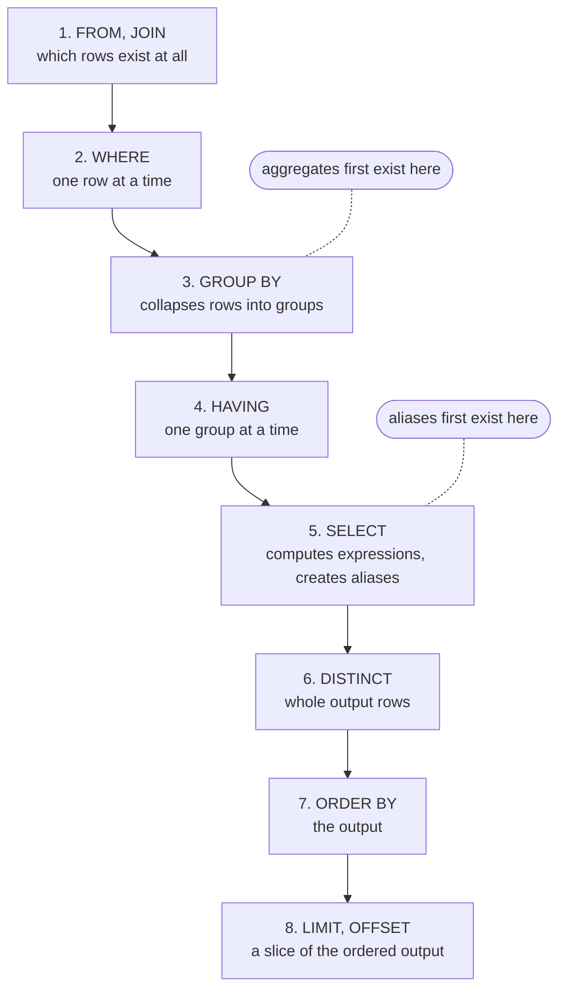

# Evaluation Order of a SELECT

Lookup sheet for stage 1. The question it exists to answer: **why does this clause not know about that name?**

## The order

| Step | Clause | Operates on |
|---|---|---|
| 1 | `FROM`, `JOIN` | which rows exist at all |
| 2 | `WHERE` | one row at a time |
| 3 | `GROUP BY` | collapses rows into groups |
| 4 | `HAVING` | one group at a time |
| 5 | `SELECT` | computes output expressions and creates aliases |
| 6 | `DISTINCT` | whole output rows |
| 7 | `ORDER BY` | the output |
| 8 | `LIMIT`, `OFFSET` | a slice of the ordered output |

Written order is 5, 1, 2, 3, 4, 6, 7, 8. Evaluation order is what the errors follow.



A name is invisible to every step above the one that creates it. That is the whole of the next two sections.

## What each clause can see

| Clause | Sees a `SELECT` alias | Sees an aggregate |
|---|---|---|
| `WHERE` | no | no |
| `GROUP BY` | engine-specific | no |
| `HAVING` | engine-specific | yes |
| `SELECT` | no, it creates them | yes |
| `ORDER BY` | yes | yes |

PostgreSQL permits an output name in `GROUP BY` and `HAVING` as an extension. The standard does not, so a portable query repeats the expression.

## The errors this explains

| Error or symptom | Cause |
|---|---|
| `column "tax" does not exist` in `WHERE` | the alias is created at step 5 |
| `column must appear in the GROUP BY clause` | a non-aggregated column in `SELECT` after grouping |
| `aggregate functions are not allowed in WHERE` | aggregates exist only from step 3 |
| filter in `HAVING` removes whole groups | `HAVING` is per group, `WHERE` is per row |
| `LIMIT` returns different rows each run | no `ORDER BY`, or a non-unique one |
| a subquery's `ORDER BY` was ignored | ordering is not a property of a relation |

## `WHERE` against `HAVING`

```sql
SELECT customer_id, count(*)
FROM orders
WHERE amount > 0            -- per row, before grouping: fewer rows to group
GROUP BY customer_id
HAVING count(*) > 5;        -- per group, after grouping
```

Moving a condition between the two **changes the answer**, not only the cost:

- `WHERE amount > 0` drops those rows and keeps the customer, with a smaller count.
- `HAVING min(amount) > 0` drops the whole customer if any order was zero.

Put a row condition in `WHERE`. Put a group condition in `HAVING`.

## Determinism

| Query | Deterministic |
|---|---|
| no `ORDER BY` | no |
| `ORDER BY` on a non-unique column | no, ties may reorder |
| `ORDER BY` ending in a unique column | yes |
| `LIMIT` with either of the first two | no |

Every paginated query needs a unique final sort key. `ORDER BY created_at DESC, id DESC` is the usual shape.

## Fixing an alias you cannot use

```sql
-- repeat the expression
SELECT amount * 0.2 AS tax FROM orders WHERE amount * 0.2 > 100;

-- or compute it once, in a subquery
SELECT tax FROM (SELECT amount * 0.2 AS tax FROM orders) t WHERE tax > 100;

-- or in a common table expression, when it is used more than once
WITH t AS (SELECT amount * 0.2 AS tax FROM orders)
SELECT tax FROM t WHERE tax > 100;
```

The subquery and the common table expression do not necessarily cost more: a planner may inline either. That is a stage 6 question, and correctness comes first.

## Sources

- [SELECT](https://www.postgresql.org/docs/current/sql-select.html)
- [7.5 Sorting Rows](https://www.postgresql.org/docs/current/queries-order.html)
- [7.6 LIMIT and OFFSET](https://www.postgresql.org/docs/current/queries-limit.html)
- [9.21 Aggregate Functions](https://www.postgresql.org/docs/current/functions-aggregate.html)
