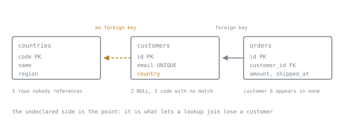

# The Dataset

Every lesson from stage 2 onward runs against the tables on this page. Load them once, keep them, and reload whenever an exercise has changed the data. Nothing here is downloaded: the whole dataset is generated by SQL you can read, so two readers who run these scripts hold identical tables and every row count printed in a lesson is a number you can reproduce rather than take on trust.

There are two sizes and they exist for different reasons.

- **The small fixture** is eight customers and twelve orders, small enough to check a query's result by eye. Stages 2 to 5 use it, and every row count a lesson quotes comes from it.
- **The large fixture** is the same schema with a hundred thousand customers and just over a million orders. Stage 6 needs it, because an index lesson on a small table teaches the opposite of the truth: on twelve rows a sequential scan really is faster, and the planner will say so.

## The schema

Stage 1's two tables are unchanged. `countries` is the one addition, and it exists so that a join has somewhere to go wrong: a lookup table with rows nobody references, and a customer whose country code is missing from it.

```sql
CREATE TABLE countries (
    code   text PRIMARY KEY,
    name   text NOT NULL,
    region text NOT NULL
);

CREATE TABLE customers (
    id      bigint PRIMARY KEY,
    email   text NOT NULL UNIQUE,
    country text
);

CREATE TABLE orders (
    id          bigint PRIMARY KEY,
    customer_id bigint NOT NULL REFERENCES customers (id),
    amount      numeric(12, 2) NOT NULL,
    shipped_at  timestamptz
);
```

## The small fixture

```sql
INSERT INTO countries (code, name, region) VALUES
    ('GB', 'United Kingdom', 'Europe'),
    ('DE', 'Germany',        'Europe'),
    ('FR', 'France',         'Europe'),
    ('US', 'United States',  'Americas'),
    ('BR', 'Brazil',         'Americas'),
    ('JP', 'Japan',          'Asia'),
    ('IN', 'India',          'Asia'),
    ('KE', 'Kenya',          'Africa');

INSERT INTO customers (id, email, country) VALUES
    (1, 'ada@example.com',      'GB'),
    (2, 'grace@example.com',    NULL),
    (3, 'alan@example.com',     'GB'),
    (4, 'katherine@example.com','US'),
    (5, 'edsger@example.com',   'NL'),
    (6, 'barbara@example.com',  'US'),
    (7, 'donald@example.com',   'JP'),
    (8, 'radia@example.com',    NULL);

INSERT INTO orders (id, customer_id, amount, shipped_at) VALUES
    (101, 1, '120.00', '2026-01-05 09:00+00'),
    (102, 1,  '80.50', '2026-01-09 09:00+00'),
    (103, 1,  '15.00', NULL),
    (104, 2, '200.00', '2026-01-11 09:00+00'),
    (105, 3,  '45.25', NULL),
    (106, 4, '999.99', '2026-02-01 09:00+00'),
    (107, 4,  '10.00', '2026-02-02 09:00+00'),
    (108, 4,  '10.00', NULL),
    (109, 5,  '60.00', '2026-02-14 09:00+00'),
    (110, 7, '340.00', NULL),
    (111, 7,  '25.75', '2026-03-01 09:00+00'),
    (112, 8, '500.00', '2026-03-03 09:00+00');
```



Twelve orders, eight customers, eight countries. Every awkward row is deliberate, because a dataset where everything matches teaches nothing about the cases that produce wrong answers.

Only one of the two relationships is declared, which is the quiet half of that design. `orders.customer_id` has a `REFERENCES` clause, so the database itself refuses an order pointing at a customer who is not there. `customers.country` has none, so `NL` is allowed to sit in a row with nothing to match, and the table below can exist at all.

| The row | Why it is there |
|---|---|
| Customer 6, no orders at all | An inner join drops it and an outer join keeps it, which is the whole of lesson 8 |
| Customer 5, country `NL` | A code with no row in `countries`, so a lookup join loses a customer who exists |
| Customers 2 and 8, country `NULL` | Absent rather than wrong, and `NULL` never matches a join condition |
| `DE`, `FR`, `BR`, `IN`, `KE` | Countries with no customers, so a right or full join has something to report |
| Orders 103, 105, 108, 110 unshipped | `shipped_at IS NULL` means not yet, so an aggregate over it counts fewer rows than the table has |
| Orders 107 and 108, both `10.00` | Duplicates are real, so `UNION` and `DISTINCT` have work to do |
| Customer 4, three orders, one huge | Skew, so a per-customer total is not the same shape as a per-country one |

## The large fixture

Load the small fixture first, then this. It adds customers 9 upward and their orders, so every identifier a lesson mentions still means the same row.

```sql
INSERT INTO customers (id, email, country)
SELECT i,
       'customer' || i || '@example.com',
       CASE (i * 7) % 100
           WHEN 0 THEN NULL
           ELSE (ARRAY['US','US','US','US','GB','GB','DE','FR','BR','JP','IN','KE'])
                [1 + (i * 7) % 12]
       END
FROM generate_series(9, 100000) AS i;

INSERT INTO orders (id, customer_id, amount, shipped_at)
SELECT 1000 + row_number() OVER (ORDER BY c.id, g),
       c.id,
       ((c.id * 37 + g * 11) % 50000) / 100.0 + 1,
       CASE WHEN (c.id + g) % 7 = 0 THEN NULL
            ELSE timestamptz '2026-01-01 00:00+00'
                 + ((c.id * 13 + g * 29) % 525600) * interval '1 minute'
       END
FROM customers c
CROSS JOIN LATERAL generate_series(1, 1 + (c.id * 13) % 20) AS g
WHERE c.id >= 9;
```

It produces 100,000 customers and 1,049,916 orders, and takes a few seconds. Two properties are worth knowing before stage 6 asks you to reason about them.

**It is deterministic, and deliberately so.** There is no `random()` and no seed anywhere: every value is arithmetic on the row's own number. Loading both scripts into an empty database twice, the tables came back byte for byte identical, checked as a checksum over every row of both tables. That is the point of generating rather than downloading, and it is why a lesson can print a row count and expect yours to match.

**The country distribution is skewed on purpose.** Roughly a third of customers are in `US`, a sixth in `GB`, an eighth in each of six others, one percent have no country at all, and exactly one is in `NL`. That range is what makes stage 6 honest: the same column holds a value so common that an index on it is worthless and a value so rare that an index on it is decisive, and the planner has to be right about both.

The evidence that this size is large enough, measured on the large fixture with statistics collected:

| Query | Without an index on `orders (customer_id)` | With it |
|---|---|---|
| One customer's orders | Parallel sequential scan, about 350,000 rows discarded per worker | Index-only scan, 7 rows read, no heap fetches |
| All orders from `US` customers, a third of the table | Two sequential scans and a hash join | Unchanged: the index is available and the planner declines it |

Both halves matter. An index that changes a plan proves the dataset is big enough to teach with; an index the planner refuses on a third of the table proves it is big enough to teach honestly.

## Reloading, and checking what you have

Reload from scratch whenever an exercise has written to the tables. The order matters, because `orders` references `customers`.

```sql
DROP TABLE IF EXISTS orders, customers, countries;
```

Then run the schema and the fixture again. To confirm what you are holding:

```sql
SELECT (SELECT count(*) FROM customers) AS customers,
       (SELECT count(*) FROM orders)    AS orders,
       (SELECT count(*) FROM countries) AS countries;
```

The small fixture answers `8`, `12`, `8`. The large one answers `100000`, `1049916`, `8`.

## One extra table, for the JSON lesson

Lesson 19 queries a document column, which the three tables above deliberately do not have. It gets its own table instead, so the schema every other lesson reasons about stays exactly as it is. Load this only when you reach that lesson.

```sql
CREATE TABLE events (
    id      bigint PRIMARY KEY,
    kind    text NOT NULL,
    payload jsonb NOT NULL
);

INSERT INTO events (id, kind, payload) VALUES
    (1, 'order_placed',   '{"order_id": 101, "items": [{"sku": "A1", "qty": 2}, {"sku": "B2", "qty": 1}], "channel": "web"}'),
    (2, 'order_placed',   '{"order_id": 104, "items": [{"sku": "A1", "qty": 5}], "channel": "app", "coupon": "SUMMER"}'),
    (3, 'payment_failed', '{"order_id": 104, "reason": "card_declined", "retries": 2}'),
    (4, 'order_placed',   '{"order_id": 112, "items": [], "channel": "web"}');
```

Four rows, and the awkwardness is again deliberate: one payload has a key the others lack, one has an empty array, one has no `items` key at all, and each `order_id` points at a real order without any foreign key to enforce it, which is exactly the situation a document column creates.

## Running it on SQLite

The small fixture loads on SQLite as written, with three differences to know about rather than work around. All three were checked by loading it.

| Difference | What happens |
|---|---|
| `DROP TABLE IF EXISTS a, b;` | A syntax error. SQLite drops one table per statement |
| `timestamptz` and `numeric(12, 2)` | Accepted as declarations, then applied as affinities: `shipped_at` comes back as text, and `120.00` is stored as the integer `120` |
| `GROUPING SETS` and `ROLLUP` | Not implemented, so the grouping material in stage 2 is PostgreSQL only |

Most of stage 2 does run on SQLite, including every join type, `FILTER`, and the `NOT IN` behaviour with a `NULL` in the subquery, which is identical. The large fixture uses `generate_series` and `LATERAL`, and whether `generate_series` exists depends on how your SQLite was built, so treat the large fixture as PostgreSQL only and use a recursive `WITH` if you want it elsewhere.

---

Stage 1's lessons predate this page and use the two tables without `countries`. Nothing there needs changing: the customers and orders they insert are the first rows here.
