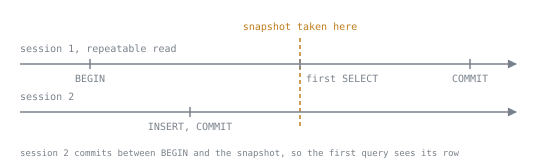

# Transactions

Lookup sheet for stage 5. The question it exists to answer: **which isolation level, lock or retryable error explains this outcome, and what SQLSTATE proves it?**

## Levels and the anomalies they permit

PostgreSQL's `BEGIN` accepts four standard level names but implements three behaviours: Read Uncommitted runs exactly as Read Committed, so a dirty read cannot be produced at any level PostgreSQL offers. Two facts about this are easy to disbelieve without running them. First, that identity: nothing in PostgreSQL ever shows one transaction another's uncommitted write, whatever level either asked for. Second, that a transaction which asked for Read Uncommitted and then reads back `current_setting('transaction_isolation')` is told `read uncommitted`, the exact name it requested, even though every read inside it behaves as Read Committed regardless. The setting echoes the request, not the behaviour that follows it.

| Level | Dirty read | Non-repeatable read | Lost update | Read skew | Phantom read | Write skew |
|---|---|---|---|---|---|---|
| Read Committed (Read Uncommitted runs identically) | Prevented | Permitted | Permitted | Permitted | Permitted | Permitted |
| Repeatable Read | Prevented | Prevented | Prevented, `40001` | Prevented | Prevented | Permitted |
| Serializable | Prevented | Prevented | Prevented, `40001` | Prevented | Prevented | Prevented, `40001` |

"Permitted" means the anomaly happens and nothing errors: a wrong number lands with no log entry pointing back at it. "Prevented" without a code means the level's snapshot rules make the wrong read impossible in the first place, no error needed. Where a code appears, the level did not stop the anomaly from being attempted, it turned the attempt into a refused commit: Repeatable Read and Serializable both fail a lost update's second write with `could not serialize access due to concurrent update`, and Serializable additionally fails write skew's second commit with `could not serialize access due to read/write dependencies among transactions`, both under `40001`. [Lesson 30](../lessons/0030-isolation-levels.md) runs the level-by-level interleavings this table summarises; [Lesson 31](../lessons/0031-the-anomalies.md) names read skew and write skew and shows the same lost update surviving unchanged as the level rises.

## What each level snapshots, and when

| Level | Snapshot taken | Held until |
|---|---|---|
| Read Committed (and Read Uncommitted) | fresh, at the start of every statement | that statement's end; the next statement takes a new one |
| Repeatable Read | once, at the transaction's first statement, not at `BEGIN` | the transaction's `COMMIT` or `ROLLBACK` |
| Serializable | once, at the same point Repeatable Read takes its snapshot | the transaction's end, plus the read/write tracking a commit can still fail against |

A statement committed by another session between `BEGIN` and a Repeatable Read or Serializable transaction's first query is visible to that first query: `BEGIN` alone takes no snapshot, the first statement does.

The whole claim is where that dashed line sits. Move it left to `BEGIN`, where it is usually assumed to be, and session 2's row would be invisible for the rest of the transaction. The distance between the two is however long the application waits before issuing its first query, which is exactly the interval nobody writing the transaction is thinking about. See [Lesson 29](../lessons/0029-mvcc.md) for the mechanism a snapshot is built from, `xmin`, `xmax` and `ctid`, and for why a reader is never made to wait on a writer regardless of level.

## The anomalies, and how to recognise yours

Dirty read has no row here: nothing in PostgreSQL produces one, so there is no shape to defend against.

| Anomaly | Shape in code | Interleaving, in one clause | Cheapest defence | Owning lesson |
|---|---|---|---|---|
| Lost update | read a value, compute in the application, write the result back | B's write lands on top of A's committed row, using a value read before A committed | rewrite the write as one statement, `balance = balance - n`, so there is no read left to go stale | [Lesson 31](../lessons/0031-the-anomalies.md) |
| Read skew | two different rows, each read once in the same transaction | a transfer between the two rows completes, and commits, between the two reads | Repeatable Read | [Lesson 31](../lessons/0031-the-anomalies.md) |
| Write skew | a shared total read once, then two different rows written from it | each side trusts a total the other's write has since made false | Serializable | [Lesson 30](../lessons/0030-isolation-levels.md), [Lesson 31](../lessons/0031-the-anomalies.md) |
| Phantom read | a count or existence check acted on later in the same transaction | a matching row is inserted and committed between the two reads | Repeatable Read for a repeated read; Serializable if a later write depends on it | [Lesson 31](../lessons/0031-the-anomalies.md) |

A row lock is not on this list as a defence for every row: `SELECT ... FOR UPDATE` fixes a lost update by making the second reader wait, but it cannot fix a phantom, because the row that ruins a count does not exist yet when the lock would be taken. Only a level that constrains the predicate itself, Repeatable Read or Serializable, reaches that case.

## Choosing a level

Read Committed is not a compromise chosen for speed, it is the right default: most application code reads and writes back in one statement, where a per-statement snapshot never has time to go stale, and both anomalies it permits, a lost update and a phantom, need a read and a later write split across separate statements to bite at all. Repeatable Read suits a report or a batch job that needs several queries to agree with each other and with nothing else, with no write in the same transaction depending on what any of them read. Serializable is the one to reach for when a rule spans more than one row, so that no single-row `CHECK` could ever see it broken, at the cost of a commit that can fail for a reason its own statements never reveal, which is why choosing it means writing the retry loop below. A level can be set on `BEGIN`, on the first statement after a plain `BEGIN` with `SET TRANSACTION ISOLATION LEVEL`, or for every later transaction with `SET default_transaction_isolation`; none of the three can change a level a transaction is already reading under. See [Lesson 30](../lessons/0030-isolation-levels.md) for all three and for the `25001` a late `SET TRANSACTION` raises.

## Locks taken on purpose

Four row-lock strengths, weakest to strongest, differ in which other locks they refuse to sit beside, not in what they let a session read:

| Strength | Conflicts with | Coexists with |
|---|---|---|
| `FOR KEY SHARE` | `FOR UPDATE` only | `FOR NO KEY UPDATE`, `FOR SHARE`, another `FOR KEY SHARE` |
| `FOR SHARE` | `FOR UPDATE`, `FOR NO KEY UPDATE` | another `FOR SHARE`, `FOR KEY SHARE` |
| `FOR NO KEY UPDATE` | `FOR UPDATE`, `FOR NO KEY UPDATE`, `FOR SHARE` | `FOR KEY SHARE` |
| `FOR UPDATE` | all four, including another `FOR UPDATE` | nothing |

`FOR KEY SHARE` is what a foreign key check takes to confirm a row still exists; `FOR SHARE` is a read that must still hold at commit; `FOR NO KEY UPDATE` is an ordinary write that leaves a row's key columns alone; `FOR UPDATE` is a write or delete guarded against any other claim. See [Lesson 32](../lessons/0032-locks.md) for the full matrix and the reasoning behind each cell.

A lock decides what a second session may not do, not how long it waits for the chance:

| Wait behaviour | What happens | SQLSTATE on failure |
|---|---|---|
| default, no clause | queues with no ceiling until the lock is released | none; it eventually succeeds, or is cut off by `lock_timeout` or `statement_timeout` below |
| `NOWAIT` | fails at once if the row is already locked | `55P03` |
| `SKIP LOCKED` | silently drops any row it cannot lock and returns what is left | none; a smaller result, not an error |

## Timeouts and settings worth knowing

| Setting | Bounds | Default | SQLSTATE on trigger |
|---|---|---|---|
| `lock_timeout` | how long one statement waits for a row or table lock specifically | `0`, disabled, wait is unbounded | `55P03` |
| `statement_timeout` | how long one statement may run for any reason, a lock wait among them | `0`, disabled | `57014` |
| `deadlock_timeout` | how long a session waits before it checks the wait graph for a cycle | `1s` | none directly; it delays how soon `40P01` is discovered, not what causes it |
| `default_transaction_isolation` | the level a transaction gets when it states none | `read committed` | none; it only supplies a starting level, and cannot reach a transaction already open |

`55P03` and `57014` are easy to tell apart from a log line alone: `55P03` says a lock specifically was the problem, `57014` says the statement ran out of time for any reason, a lock wait included. `lock_timeout` is the better default on a write path for exactly that reason: it fails fast on the one risk it is aimed at, without cutting off a statement that is merely slow for some other cause.

## Which errors are worth retrying

| SQLSTATE | Meaning | Retry can succeed? | What the retry must do differently |
|---|---|---|---|
| `40001` | Repeatable Read or Serializable refused a commit: a concurrent update on the same row, or a read/write dependency Serializable tracked | Yes | re-read and re-decide inside the new attempt rather than resend the same write; see [Lesson 34](../lessons/0034-idempotency-and-retry.md) |
| `40P01` | the deadlock detector found a cycle and cancelled one of the two transactions waiting on each other's locks | Yes | retry the cancelled side; only reordering the locks the two transactions take stops the same cycle forming again |
| `55P03` | a row or table lock could not be got: `NOWAIT` refused to queue, or `lock_timeout` cancelled the wait | Yes, once the holder has committed or rolled back | wait longer or re-check the row is still worth locking before trying again |
| `57014` | `statement_timeout` cancelled the statement before it finished, for any reason | Sometimes | find out why it was slow first; retrying blind repeats a slow scan or a lock wait without addressing either |
| `23505` | a `UNIQUE` or primary key found the value already present | No | nothing to resend; check whether the row already reflects the intended write, or use `ON CONFLICT` |
| `25P02` | an earlier statement in this transaction already failed, and every statement since is refused without being run | No, not by resending the failed statement | issue `ROLLBACK` first, then retry the whole transaction from its first statement |

`23505` and `25P02` are the two traps: both look like ordinary errors worth another attempt, and neither is. A `23505` retry only succeeds if something else about the row changes first; a `25P02` retry only succeeds once the aborted transaction is actually closed, since every statement inside it, however unrelated to the failure, is refused alike.

## The retry that is correct

A retry loop only earns the name if it does four things: bounds its attempt count, so a conflict that never clears cannot loop forever; re-reads whatever the decision needs inside every attempt, not only on the first; checks the SQLSTATE before looping, retrying only `40001` and `40P01` and raising anything else at once; and waits a growing delay between attempts, so two colliding callers do not retry in lockstep and collide again. The property that matters most is the second: a retry that resends the same write without re-reading is a replay, and a replay reproduces the anomaly the level was refusing in the first place, just on a second attempt instead of the first. [Lesson 34](../lessons/0034-idempotency-and-retry.md) demonstrates exactly that failure and its fix.

## The diagnostics of the stage

Every error message a lesson quoted, with its SQLSTATE and cause. Where a message's `DETAIL` carries numbers that differ on every run, a process id, a transaction id or similar, that is noted instead of quoted.

| Error | SQLSTATE | Cause |
|---|---|---|
| `division by zero` | `22012` | an ordinary runtime error inside a transaction, no different from one outside it except for what happens next |
| `current transaction is aborted, commands ignored until end of transaction block` | `25P02` | a later statement in a transaction where an earlier one already failed; only `ROLLBACK` clears the state |
| `savepoint "..." does not exist` | `3B001` | `ROLLBACK TO SAVEPOINT` named a mark that was never taken; the transaction stays aborted |
| `could not serialize access due to concurrent update` | `40001` | Repeatable Read or Serializable refused a second writer's commit against a row the first writer had already changed |
| `could not serialize access due to read/write dependencies among transactions` | `40001` | Serializable cancelled a commit that would have produced a result no one-at-a-time ordering of the two transactions could reach; its `DETAIL` names a reason code and its `HINT` notes a retry might succeed, neither carrying a number worth quoting |
| `SET TRANSACTION ISOLATION LEVEL must be called before any query` | `25001` | the level was changed mid-transaction, after a snapshot had already been taken under the old one |
| `could not obtain lock on row in relation "..."` | `55P03` | `NOWAIT` met a row already locked and refused to queue behind it |
| `canceling statement due to lock timeout` | `55P03` | `lock_timeout` expired while the statement queued for a row or table lock |
| `canceling statement due to statement timeout` | `57014` | `statement_timeout` expired, for any reason, a lock wait among them |
| `deadlock detected` | `40P01` | the server found a cycle in the wait graph and cancelled one of the two transactions that formed it; its `DETAIL` names both processes and the transactions each is waiting for, with numbers that differ on every run |
| `duplicate key value violates unique constraint "..."` | `23505` | a `UNIQUE` or primary key found the value already present, whether from ordinary contention or from a retry that resent a write that had already landed |

## What does not travel to SQLite

None of this stage's seven lessons ran anything against SQLite, and none quoted a fact about its transaction model. Every level, lock and SQLSTATE above is specific to PostgreSQL, and nothing in this stage established which of it, if any, carries over. The honest statement is not a comparison, only that the stage did not check.
