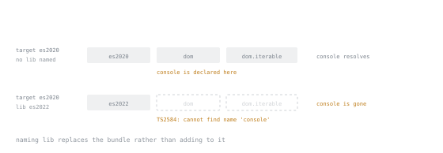

# Lesson 20. target and lib

**Mission link:** Owning a configuration means knowing which setting to change when a build fails to run somewhere and which setting to change when a type-check accepts something that will not exist at runtime, and those are two different settings.
**Primary source:** [TSConfig Reference](https://www.typescriptlang.org/tsconfig/#target)
**Prerequisites:** [Lesson 19](0019-reading-a-tsconfig.md), [Lesson 8](0008-the-types-you-write.md)

## Warm-up

1. ▢ Lesson 19 pointed at `target` while reading `tsc --init`'s output and left it for this lesson to settle, rather than treating it as one more checking flag alongside `strict`. Given that, guess before reading a word further: does `target` change what the compiler checks, or something else entirely?

<details markdown="1"><summary>Check</summary>

Something else: what it emits, not what it checks. `lib`, its usual companion, is the one that changes what exists to check against, and telling those two apart, and seeing exactly how they are connected, is this whole lesson.

</details>

## Know this

### Two jobs that get confused for one

`target` and `lib` sit next to each other in a configuration and get confused with each other constantly, and the confusion produces errors that read as if the type system itself has gone wrong. `target` decides what JavaScript the compiler emits: which syntax it lowers into something older and which it leaves exactly as written. `lib` decides which library declarations exist while the compiler is checking: which globals, which methods, which whole built-in objects it will accept a reference to at all. One setting is about the file that comes out the other end, the other is about the type environment the checker works inside, and they are connected by exactly one thing: `target` chooses a default for `lib` whenever you do not name one yourself.

### `target` changes what comes out, not what checks

A private field type-checks identically at every target. The cleanest way to see the two are unrelated is to compile the same class twice and read both outputs.

```ts
class Counter {
  #x = 0;
  inc() {
    this.#x++;
    return this.#x;
  }
}
```

Compiled with `--target es2022`, the emitted file keeps the field almost exactly as written:

```js
class Counter {
    #x = 0;
    inc() {
        this.#x++;
        return this.#x;
    }
}
```

Compiled from the same source with `--target es2015`, the class comes out unrecognisable: `#x` is lowered to a `WeakMap` keyed by the instance, with a mangled name standing in for the field, and every read and write is routed through two generated helper functions:

```js
var _Counter_x;
class Counter {
    constructor() {
        _Counter_x.set(this, 0);
    }
    inc() {
        __classPrivateFieldSet(this, _Counter_x, __classPrivateFieldGet(this, _Counter_x, "f") + 1, "f");
        return __classPrivateFieldGet(this, _Counter_x, "f");
    }
}
_Counter_x = new WeakMap();
```

Both compiles exit clean with no diagnostic either time, because `target` never touched the check; `Counter`'s type is exactly the same class in both runs. What changed is only what a reader of the compiled file actually sees.

### `target` sets the default `lib`

Because `target` also chooses `lib` by default, a target that predates a method's introduction into the language means the compiler has never heard of that method, at any target older than the one that added it.

```ts
console.log(Object.hasOwn({ a: 1 }, "a"));
```

This compiles clean at `--target es2022` and fails at `--target es2020`:

```text
error TS2550: Property 'hasOwn' does not exist on type 'ObjectConstructor'. Do you need to change your target library? Try changing the 'lib' compiler option to 'es2022' or later.
```

`Array.prototype.at` fails the same way one target earlier, refused at `es2021` and accepted at `es2022`, with the identical `TS2550` and the identical suggestion. Read that suggestion literally: the compiler is naming the exact setting responsible, which is unusually helpful and worth trusting the first time you see it.

### Naming `lib` throws the default away

Given the last section, the obvious fix for a method missing at an older target looks like naming `lib` directly instead of raising `target`. That is the trap, and it is worth watching it fail once on purpose. Compiled with `--target es2020 --lib es2022`, this file fails, even though it does nothing but call `console.log`:

```text
error TS2584: Cannot find name 'console'. Do you need to change your target library? Try changing the 'lib' compiler option to include 'dom'.
```



The two dropped libraries are drawn in the slots they used to occupy, because that is what the option did: it did not leave them and add one, it put one where three had been.

Most options in a configuration merge with their default or add to a list. `lib` does not. Naming it at all replaces the whole bundle a target would otherwise have supplied, rather than adding one entry to it. The default bundle behind `es2020` is not `es2020` on its own, it is `es2020` plus `dom` plus `dom.iterable`, and `console` is declared inside `dom`, not inside any `esXXXX` library. Writing `--lib es2022` said "use exactly this and nothing else", and "nothing else" turned out to include the one declaration this file actually used. The fix is to name the whole bundle you mean, `--lib es2022,dom` here, or to raise `target` instead and let its default follow.

### The DOM library is present by default, whether or not that is wanted

`document.title` compiles with no `lib` setting written anywhere, in a project that has nothing to do with a browser:

```ts
console.log(document.title);
```

This compiles clean at the default target with no `lib` option in sight, because every target's default bundle includes `dom`. The compiler cannot tell from a target version alone whether the code will run in a browser or on a server, so it includes the browser declarations everywhere and lets the checker accept them everywhere. This matters because a project actually running on Node's active long-term-support line provides none of it: no `document`, no `localStorage`, no `window`. A line reaching for `localStorage.setItem` type-checks without complaint under the default library and then fails the moment it runs, because a passing check only ever guarantees what it checked, and it checked against a library that was never true for this runtime. That is the same gap between a claim the type checker makes and a guarantee about what exists at runtime that this arc has been naming since lesson 2, wearing a configuration setting's clothes. It is exactly why naming `lib` deliberately for a project that never touches a browser is worth doing, even though the trap above just showed how easily naming it goes wrong.

### One target that no longer exists

`--target es5` used to be an ordinary floor for old browsers. It is refused outright now:

```text
error TS5108: Option 'target=ES5' has been removed. Please remove it from your configuration.
```

Treat that as a live migration fact. A configuration inherited from an older project that still names `es5` will not build on this compiler, before a single line of the project's own code is read.

### Choosing both

Pick `target` from what actually has to run the compiled output: a runtime with known feature support gets a target naming that support, and a build feeding a bundler that lowers things further can afford to name a newer one. Pick `lib` from what the runtime genuinely provides, independent of what its default would hand you: a browser project keeps `dom`, a Node project drops it and names the `esXXXX` library it actually wants, accepting the trap above as the cost of an honest type environment. `tsc --init` on this compiler writes `target: esnext`, evidence of where the concern has moved: emitting for compatibility with an old runtime is a far smaller worry than it used to be, and the more common mistake now is trusting a `lib` nobody chose.

## Practice

1. ▢ Predict whether this compiles at `--target es2020`, and what changes if the target is raised to `es2022`.

   ```ts
   const a = [1, 2, 3];
   console.log(a.at(0));
   ```

<details markdown="1"><summary>Check</summary>

Fails at `es2020` with `error TS2550: Property 'at' does not exist on type 'number[]'. Do you need to change your target library? Try changing the 'lib' compiler option to 'es2022' or later.`, because `at` was added to the language in the same release as `Object.hasOwn`, and `es2020`'s default library predates both. Raising `--target` to `es2022` compiles clean with no other change, because the default `lib` moves with it.

</details>

2. ▢ Predict the diagnostic for this file, compiled with `--target es2022 --lib es2015`.

   ```ts
   console.log("hi");
   ```

<details markdown="1"><summary>Check</summary>

`error TS2584: Cannot find name 'console'. Do you need to change your target library? Try changing the 'lib' compiler option to include 'dom'.` Naming `--lib es2015` replaces `es2022`'s entire default bundle, `dom` included, with exactly `es2015` and nothing else. The target chooses the library only until a `lib` is named; after that, `target` stops having anything to say about it.

</details>

3. ▢ Compiled with `--lib es2022` and no `dom`, predict what happens to this line, and whether the diagnostic offers the same kind of hint the two items above got.

   ```ts
   fetch("https://example.com");
   ```

<details markdown="1"><summary>Hint</summary>

`TS2550` and `TS2584` both named a setting to try because the compiler could see the missing member sitting inside a library it recognised. Ask whether that is guaranteed for every missing global, or only for the ones the compiler happens to trace back to a known library.

</details>

<details markdown="1"><summary>Check</summary>

`error TS2304: Cannot find name 'fetch'.`, with no suggestion attached. `fetch` is declared in `dom`, the same library `console` needed, yet this diagnostic offers nothing like "Do you need to change your target library?". The helpful hint in the earlier examples is real but not universal, and a bare `TS2304` is what a genuinely undeclared name looks like, worth telling apart from the friendlier `TS2550` and `TS2584`.

</details>

4. ▢ A `tsconfig.json` inherited from an old project sets `"target": "es5"`. Predict what happens on this compiler before a single source file is read.

<details markdown="1"><summary>Check</summary>

`error TS5108: Option 'target=ES5' has been removed. Please remove it from your configuration.` The option itself is refused, at the configuration file, so the project will not build until that line is changed to a target this compiler still recognises.

</details>

5. ▢ Predict the emitted JavaScript for this function at `--target es2019`, given that it compiles with no error at either target.

   ```ts
   function greet(name: string | undefined) {
     return name ?? "stranger";
   }
   ```

<details markdown="1"><summary>Hint</summary>

`??` was added to the language after `es2019`. Ask what a target does with syntax it predates, given that it is not allowed to reject the code.

</details>

<details markdown="1"><summary>Check</summary>

`return name !== null && name !== void 0 ? name : "stranger";`. The `??` operator is lowered to an explicit check against both `null` and `undefined`, because `es2019` has no native nullish coalescing to emit. At `es2020` and later the operator is left exactly as written. Neither version reports a diagnostic, since `target` was never deciding whether the code type-checks, only what it looks like afterwards.

</details>

## Real-world reps

- [ ] Open a project's configuration and find its `target`. Before checking, predict whether `lib` is named explicitly, and if it is not, name one method or global that target's default library provides that a target three releases older would refuse.
- [ ] Find, or write, one line of code that would fail to compile if the project's `target` dropped to the version before the feature it uses was added, and say in one sentence whether the failure would be about emit or about the library, not both.
- [ ] Tomorrow: pick a Node project and check whether its configuration names `lib` at all. If it does not, look for one browser-only global the code could reach for that would type-check today and only fail once it actually runs.

## Going further

- [TSConfig Reference: lib](https://www.typescriptlang.org/tsconfig/#lib): every library bundle by name, and which target pulls in which by default
- [TypeScript Release Notes](https://www.typescriptlang.org/docs/handbook/release-notes/overview.html): what each new target version actually added, to check a claim like this one against
- [Resources](../RESOURCES.md)

---

Not landing? Reread the primary source at the top, since this lesson compresses it and compression is where understanding leaks. Check the [glossary](../GLOSSARY.md) for any term that felt slippery.

If the lesson itself is unclear rather than the material, that is a defect: [open an issue](https://github.com/TokenCemetery/teach/issues).
