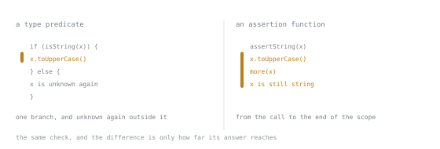

# Lesson 32. Type Predicates and Assertion Functions

**Mission link:** Owning a codebase means reading a function named `isX`, trusting it the way the compiler does, and knowing that the trust belongs to whoever wrote its body, not to its name.
**Primary source:** [Narrowing, TypeScript Handbook](https://www.typescriptlang.org/docs/handbook/2/narrowing.html)
**Prerequisites:** [Lesson 31](0031-parsing-instead-of-asserting.md), [Lesson 18](0018-an-assertion-is-not-a-check.md)

## Warm-up

1. ▢ Lesson 12 set aside a function that performs its own runtime check, calling it a type guard, and left for later the question of what the compiler's trust in it is worth. Given `function isString(x: unknown): x is string { return typeof x === "string"; }`, predict whether calling it inside an `if` narrows `x` the same way writing `typeof x === "string"` directly would.

<details markdown="1"><summary>Check</summary>

It does, verified: inside `if (isString(x)) { x.toUpperCase(); }`, `x` narrows to `string` and the call compiles with no diagnostic, exactly as if lesson 12's `typeof` check had been written inline. The compiler is not treating `isString` as an ordinary call; the `x is string` in its return position registers it as a narrowing operator, alongside `typeof`, `instanceof`, `in` and literal equality, except this one is written by a person instead of built into the language. The handbook's name for it is a type predicate, the term this lesson uses; lesson 12's "type guard" was the informal name for the same thing, waiting for the question this lesson now asks: what is that trust actually worth?

</details>

## Know this

### The claim the body never has to earn

Narrowing on `typeof x === "string"` is trustworthy because the engine decides the answer. Narrowing on `isString(x)` from the warm-up is trustworthy only if the body actually tests what the signature claims, and nothing forces that to be true. Keep the same signature and replace the body with `return true;`:

```ts
function isString(x: unknown): x is string {
  return true;
}
```

Compiles. No diagnostic, verified on TypeScript 7.0.2. The same is true the other way round, a predicate that claims one type while its body tests for a different one:

```ts
function isNumber(x: unknown): x is number {
  return typeof x === "string";
}
```

Also compiles, also with no diagnostic. **The body is never checked against the claim.** The compiler reads `x is number` off the signature, records it as the narrowing effect of a successful call, and never asks whether the `typeof` test three characters later has anything to do with a number. Call `isString(42)` and enter the branch anyway, because the body says so unconditionally; call `.toUpperCase()` inside, because the branch told the compiler it was safe:

```text
TypeError: x.toUpperCase is not a function
```

That is lesson 18's subject arriving in a new shape. `x is T` is `as T` wearing a function signature. The return type is a claim, the body is unaudited, and the compiler trusts you completely, exactly as it trusts an `as`.

### Worse than a bare `as`, in one specific way

A bare `as T` is visible at the exact place the lie happens; a reader staring at that line can ask what licenses it. A predicate moves the lie one level away, into a named function that reads like a check and is then trusted silently at every branch that calls it. `if (isConfig(x))` looks, on a skim, like a real test just ran, and whether one did depends on a body sitting elsewhere that nobody rereads once the function has a name and a green build behind it. A wrong `as` is one wrong line; a wrong predicate is that line applied at every call site the function has, present and future. That is why a predicate deserves lesson 18's standard applied with more scrutiny, not less: its confident shape is exactly what makes a hollow body easy to miss.

### Assertion functions narrow forward, not sideways

A predicate narrows inside the branch that called it. An assertion function narrows everything after the call, no branch needed, using `asserts x is T` instead of `x is T`:



Both bars begin on the same line, and only their ends differ. The check itself is identical in the two versions, so what the signature buys is not a better answer but a wider region over which the answer keeps applying.

```ts
function assertString(x: unknown): asserts x is string {
  if (typeof x !== "string") {
    throw new Error("not a string");
  }
}
function useIt(x: unknown) {
  assertString(x);
  x.toUpperCase(); // x is string from here on
}
```

Verified: compiles, `x` is `string` for the rest of `useIt`, the same forward-narrowing shape lesson 12 showed for an early `return`. One constraint is worth knowing before it surprises you. Assign the same function to a `const` with no type written on it, and the assertion stops narrowing:

```ts
const wrapped = assertString;
function useIt(x: unknown) {
  wrapped(x);
  x.toUpperCase();
}
```

```text
error TS2775: Assertions require every name in the call target to be declared with an explicit type annotation.
```

Narrowing from an assertion has to be decided from the declaration alone, before the compiler follows the call at all. A `function` declaration carries its `asserts` clause as part of what it is; `wrapped`'s type comes from inference, and inference is not allowed to smuggle an assertion effect through a plain variable that could later point to something else. Writing the type explicitly, `const wrapped: (x: unknown) => asserts x is string = assertString;`, restores it, since the promise now sits on the declaration itself. What to do once the check fails, throw what and in what shape, is lesson 33's material; this lesson stops at what the signature buys.

### When each is the right tool

A warning-only lesson teaches avoidance, not judgment, and both of these have a real job. A predicate earns its place when the check is real and the type cannot be written any other way: narrowing a union by something other than its discriminant, wrapping a third-party check that genuinely tests the thing it claims, or filtering an array so the result type drops the excluded members, the case that pays most often. Plain `.filter()` does not do this on its own:

```ts
interface Fulfilled<T> { status: "fulfilled"; value: T }
interface Rejected { status: "rejected"; reason: unknown }
type Settled<T> = Fulfilled<T> | Rejected;

function isFulfilled<T>(r: Settled<T>) {
  if (r.status !== "fulfilled") {
    return false;
  }
  return true;
}

const settled: Settled<number>[] = [
  { status: "fulfilled", value: 1 },
  { status: "rejected", reason: "boom" },
];
const ok = settled.filter(isFulfilled);
const nums: number[] = ok.map((r) => r.value);
```

Verified: `ok` stays `Settled<number>[]`, since `isFulfilled` here returns a plain `boolean`, and reading `.value` off it fails:

```text
error TS2339: Property 'value' does not exist on type 'Settled<number>'.
  Property 'value' does not exist on type 'Rejected'.
```

Add `: r is Fulfilled<T>` to `isFulfilled`'s signature, body untouched, and the same filter now produces `Fulfilled<number>[]`, and `.value` compiles. The check was always correct; only the type the signature reported for a passing check was missing. An assertion function earns its place at the top of a function, in place of a guard clause, when failing the check is a bug rather than a normal branch, so the rest of the function can read as if the precondition already held.

### The comparison with a parser

Lesson 31 gave you a schema: one declaration produces both the runtime check and the type, so the two cannot disagree, since there is only one place either comes from. A predicate is the opposite arrangement, the type declared in the signature and the check whatever you happened to write in the body, two separate things that can drift apart exactly as the `return true;` case showed. Neither is wrong; they answer different questions. At a boundary, where a value first arrives from outside the program, parse it, since that is where the gap between a claim and a check is most expensive and least visible. Inside the program, refining a value that already has a type against a union the checker already knows about, a predicate is a reasonable, cheap way to say which member you have found. A predicate used *as* a boundary check, standing in for a parse on a value fresh from a network response or a file, is the mistake this stage exists to prevent: it looks exactly as strict as a parser and catches nothing a parser would have caught.

### Making a predicate worth trusting

Nothing else will check it, so treat the body as the one thing standing between the claim and reality. Keep it exhaustive against what the signature promises, testing the actual shape rather than a proxy for it. Keep it small enough to read start to finish in one sitting, since a predicate too long to hold in view is a predicate nobody rereads once it works. And test it, both directions, a value that should pass and one that should not, since the compiler that trusts the signature will never run the body to see whether it still deserves that.

## Practice

1. ▢ Predict whether this compiles, and if `x` is actually `42` at the call site, predict what happens when the branch runs.

   ```ts
   function isString(x: unknown): x is string {
     return true;
   }
   function shout(x: unknown) {
     if (isString(x)) {
       console.log(x.toUpperCase());
     }
   }
   shout(42);
   ```

<details markdown="1"><summary>Check</summary>

Compiles, no diagnostic: the signature's claim is all the compiler checks. At run time `isString(42)` returns `true` unconditionally, the branch runs, and `42..toUpperCase` does not exist: `TypeError: x.toUpperCase is not a function`. The predicate did not lie about `x`; it lied about what a passing call means, and the branch believed it.

</details>

2. ▢ Predict whether this compiles, and if `x` is the string `"9"` at the call site, predict what happens when the branch runs.

   ```ts
   function isNumber(x: unknown): x is number {
     return typeof x === "string";
   }
   function double(x: unknown) {
     if (isNumber(x)) {
       console.log(x.toFixed(2));
     }
   }
   double("9");
   ```

<details markdown="1"><summary>Hint</summary>

Ask what the body actually tests, and compare it against what the signature claims. They are not testing the same thing.

</details>

<details markdown="1"><summary>Check</summary>

Compiles, no diagnostic, for the same reason as item 1: the test that runs and the type narrowed are unrelated. `isNumber("9")` returns `true` because `"9"` really is a `string`, the branch is entered, and `x` is treated as `number` inside it. `"9".toFixed` does not exist: `TypeError: x.toFixed is not a function`.

</details>

3. ▢ `assertString` from Know this is stored on an object instead of reassigned, `const helpers = { check: assertString };`, and called as `helpers.check(x)` in its place. Predict whether the file still compiles, and name the diagnostic if not.

<details markdown="1"><summary>Check</summary>

It does not: `error TS2775: Assertions require every name in the call target to be declared with an explicit type annotation.` `helpers.check`'s type comes from inference on the object literal, not from a declaration the compiler can read an `asserts` clause off directly, so the same restriction applies as for a bare reassignment.

</details>

4. ▢ Same `Settled`, `Fulfilled` and `Rejected` types as Know this, but `isFulfilled` is written with no `is` clause, only `: boolean`. Predict whether `settled.filter(isFulfilled)[0].value` compiles, and say the one edit to the signature, body untouched, that fixes it.

<details markdown="1"><summary>Check</summary>

Fails: `error TS2339: Property 'value' does not exist on type 'Settled<number>'.` A `boolean`-returning `isFulfilled` narrows nothing, so `.filter` leaves `Rejected` in the result. Changing the return type to `r is Fulfilled<T>`, body untouched, makes the filtered array `Fulfilled<number>[]` and the line compiles.

</details>

5. ▢ A pull request adds `function isConfig(x: unknown): x is Config { return typeof x === "object" && x !== null; }` and uses it directly on the result of `JSON.parse` at the point a settings file is read. What, precisely, is wrong with this as a boundary check, and what would make it acceptable?

<details markdown="1"><summary>Check</summary>

The body tests only that `x` is a non-null object, which every plain object satisfies, not that it has the shape `Config` requires; a settings file missing every field `Config` declares still passes. As written, this is a predicate standing in for a parse at exactly the point lesson 31 said needs one, and it looks just as strict as a real check while catching almost nothing. It becomes acceptable by parsing the parsed JSON against a schema for `Config` at that boundary, the way lesson 31 taught, rather than narrowing an already-`unknown` value with a hand-written predicate whose body never earns the claim.

</details>

## Real-world reps

- [ ] Search a codebase for a function whose return type contains `is `, and read every body against its own claim; note any that test something narrower or different from what the signature promises.
- [ ] Find a predicate feeding a `.filter()` call, and check the inferred type of the result against the type before filtering; if the two are identical, the predicate is not narrowing anything and the `is` clause is decorative.
- [ ] Tomorrow: find one predicate or assertion function in a project you touch that runs directly on a value freshly arrived from outside the program, a parsed body, a query parameter, a file read, rather than on a value already typed inside the program, and treat that boundary the way lesson 31 taught, with a parser instead.

## Going further

- [Effective TypeScript](https://effectivetypescript.com/): for more on writing a custom narrowing function that earns the trust its signature asks for
- [TypeScript issue archive](https://github.com/microsoft/TypeScript/issues): searchable discussion of predicate and assertion-function edge cases the handbook states briefly
- [Resources](../RESOURCES.md)

---

Not landing? Reread the primary source at the top, since this lesson compresses it and compression is where understanding leaks. Check the [glossary](../GLOSSARY.md) for any term that felt slippery.

If the lesson itself is unclear rather than the material, that is a defect: [open an issue](https://github.com/TokenCemetery/teach/issues).
