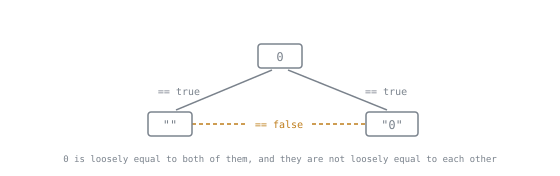

# Coercion and Equality

Lookup sheet for stage 1. The question it exists to answer: **what will this value do in a comparison or a condition?**

## The types

| Primitive | Notes |
|---|---|
| `undefined` | produced by the language: unassigned, missing, not passed |
| `null` | written by a programmer to mean deliberately empty |
| `boolean` | |
| `number` | 64-bit float; integers exact only up to 2^53 - 1 |
| `bigint` | arbitrary-precision integers, not mixable with `number` |
| `string` | immutable, UTF-16 code units |
| `symbol` | unique property keys |

Everything else is an object, including arrays, functions, `Date`, `Map` and `RegExp`.

## `typeof`, and where it lies

| Expression | Result |
|---|---|
| `typeof undefined` | `"undefined"` |
| `typeof null` | `"object"`, a historical wart |
| `typeof []` | `"object"`; use `Array.isArray` |
| `typeof (() => {})` | `"function"` |
| `typeof NaN` | `"number"` |
| `typeof 1n` | `"bigint"` |

## Falsy values

`false`, `0`, `-0`, `0n`, `""`, `null`, `undefined`, `NaN`.

Everything else is truthy, including `"0"`, `"false"`, `" "`, `[]`, `{}`, and every function.

`[]` and `{}` being truthy is the one that surprises. For "has items", write `items.length > 0`.

## `==` against `===`

`===` compares type and value, with no conversion. `==` converts first.

| Expression | `==` | `===` |
|---|---|---|
| `1 == "1"` | true | false |
| `0 == ""` | true | false |
| `0 == "0"` | true | false |
| `"" == "0"` | false | false |
| `0 == false` | true | false |
| `[] == false` | true | false |
| `null == undefined` | true | false |
| `null == 0` | false | false |
| `NaN == NaN` | false | false |

`==` is not transitive: `0 == ""` and `0 == "0"` hold while `"" == "0"` does not.

Three rows of the table above, drawn as the shape they make. A relation that fails to close like this cannot be used to reason with: knowing `a == b` tells you nothing you may carry to `c`, so no chain of `==` comparisons is safe to follow even when every individual row of the table looks harmless. That is the argument for the rule below, rather than a list of surprising pairs to memorise.

**Rule:** use `===` everywhere, with one exception: `x == null` tests for `null` or `undefined` in one operator and is idiomatic.

## Special comparisons

| Need | Write |
|---|---|
| is it `NaN` | `Number.isNaN(x)` |
| is it `null` or `undefined` | `x == null` |
| distinguish `-0` from `0`, or match `NaN` | `Object.is(a, b)` |
| does an array contain `NaN` | `arr.includes(NaN)`, not `indexOf` |
| compare objects by contents | no built-in; write it or use a library |

`indexOf` uses `===`, so it never finds `NaN`. `includes` uses SameValueZero, so it does.

## Defaults and access

| Operator | Falls back on | Use when |
|---|---|---|
| `a \|\| b` | any falsy `a` | `0`, `""` and `false` are not valid values |
| `a ?? b` | `null`, `undefined` | almost always |
| `a?.b` | short-circuits on `null`, `undefined` | the object may be absent |
| `a \|\|= b`, `a ??= b` | same rules as above | in-place assignment |

The logical-or default is the most common live bug in a TypeScript codebase, because `0`, `""` and `false` are ordinary values in most domains.

## Numbers

| Expression | Result |
|---|---|
| `0.1 + 0.2 === 0.3` | `false` |
| `0.1 + 0.2` | `0.30000000000000004` |
| `Number.MAX_SAFE_INTEGER + 2` | not distinguishable from `+ 3` |
| `parseInt("08")` | `8` |
| `Number("")` | `0` |
| `Number(" 12 ")` | `12` |
| `Number("12px")` | `NaN` |
| `parseInt("12px")` | `12` |

For money and identifiers, use integers of the smallest unit, strings, or `bigint`. Never a float.

## Reviewing a condition

1. What are the falsy values of this type? If `0` or `""` is one of them, `||` is suspect.
2. Is the comparison `==`? If so, is it the `x == null` exception, and if not, replace it.
3. Is either side possibly `NaN`? Then no comparison operator works, and `Number.isNaN` is the test.
4. Are both sides objects? Then `===` compares identity and the code probably wanted contents.

## Sources

- [ECMAScript Language Types](https://tc39.es/ecma262/#sec-ecmascript-language-types)
- [IsLooselyEqual](https://tc39.es/ecma262/#sec-islooselyequal)
- [IsStrictlyEqual](https://tc39.es/ecma262/#sec-isstrictlyequal)
- [You Don't Know JS Yet: Types & Grammar, chapter 4](https://github.com/getify/You-Dont-Know-JS/blob/2nd-ed/types-grammar/ch4.md)
