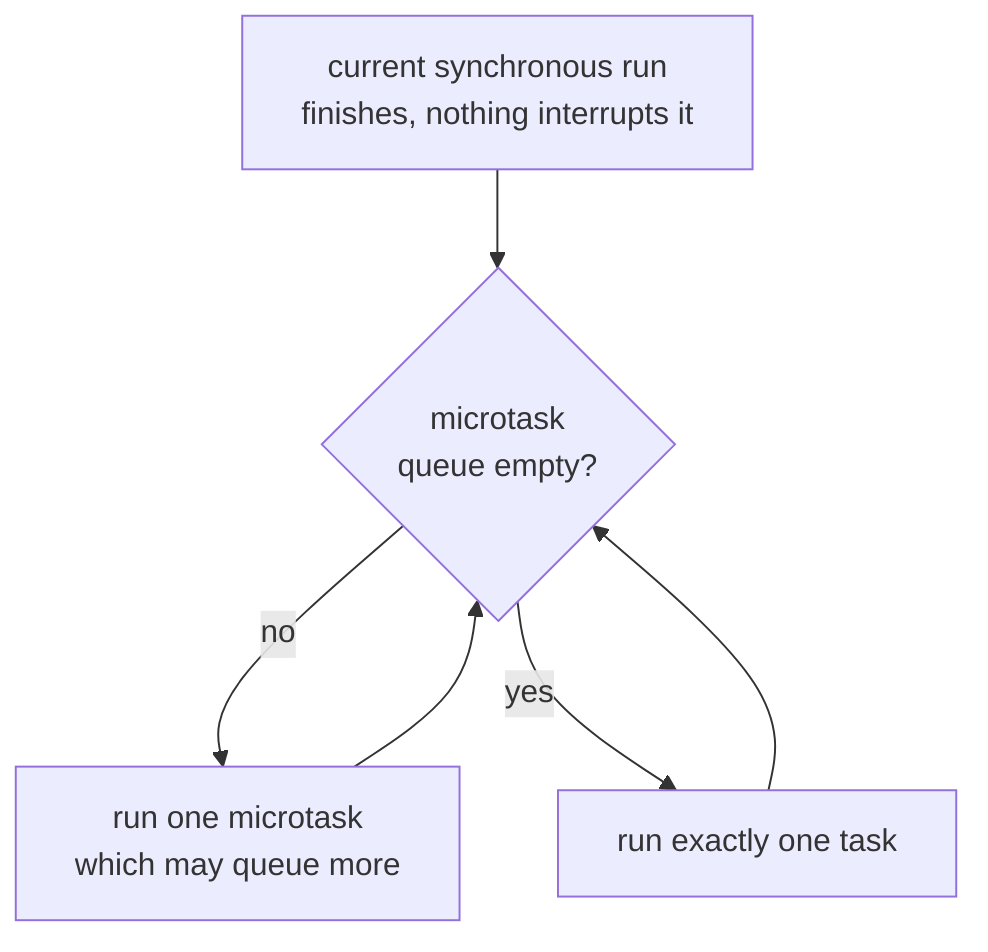

# Event Loop and Promises

Lookup sheet for stage 1. The question it exists to answer: **in what order does this run, and what happens to the errors?**

## Ordering

One thread. No callback interrupts running code. After the current synchronous run finishes:

1. Drain the **entire** microtask queue, including microtasks queued by microtasks.
2. Take **one** task.
3. Repeat.



The two loops are not symmetric, and that is the whole shape: the inner one runs until the queue is empty, the outer one takes a single task each time round.

| Source | Queue |
|---|---|
| `Promise.then`, `catch`, `finally` | microtask |
| the continuation after an `await` | microtask |
| `queueMicrotask` | microtask |
| `process.nextTick` (Node only) | ahead of other microtasks |
| `setTimeout`, `setInterval` | task |
| I/O callbacks | task |
| `setImmediate` (Node only) | task, after I/O in the same turn |

Worked example:

```ts
console.log("1");
setTimeout(() => console.log("2"), 0);
Promise.resolve().then(() => console.log("3"));
console.log("4");
// 1 4 3 2
```

Two consequences worth stating:

- A synchronous loop that takes one second delays every timer and every response by one second. There is no pre-emption.
- An unbroken chain of promise reactions starves tasks completely, because the microtask queue must be empty before a task runs.

## `await`

- An `async` function runs **synchronously** until its first `await`, then returns a promise.
- `await` always yields, even on an already-resolved value or a non-promise. Everything after it is a microtask.
- Local bindings survive the suspension, because the continuation is a closure.
- `await` in a `for...of` loop is sequential. `await` inside `forEach`, `map` or `filter` awaits nothing.

## Combinators

| Combinator | Settles when | On rejection | Result shape |
|---|---|---|---|
| `Promise.all` | all fulfil | rejects on first | array of values |
| `Promise.allSettled` | all settle | never rejects | array of `{status, value \| reason}` |
| `Promise.race` | first settles | adopts it | one outcome |
| `Promise.any` | first fulfils | rejects only if all do | one value, or `AggregateError` |

`Promise.all` rejecting does **not** cancel the others. They continue, and a second rejection with no handler becomes an unhandled rejection. Use `allSettled` when every outcome matters.

## Sequential against concurrent

```ts
const a = await getA();                              // 100ms
const b = await getB();                              // + 100ms = 200ms total

const [a2, b2] = await Promise.all([getA(), getB()]); // 100ms total
```

Nothing in the syntax marks the difference. Check every pair of consecutive `await`s for a dependency that may not exist.

## Mistakes the compiler does not report

| Mistake | Symptom | Fix |
|---|---|---|
| `doWork()` without `await` | errors vanish, ordering undefined, process may exit | `await`, or `.catch(...)` deliberately |
| `arr.forEach(async ...)` | nothing waits, rejections float | `for...of` with `await`, or `Promise.all(arr.map(...))` |
| `await` in a loop when calls are independent | latency is the sum | `Promise.all` |
| `Promise.all` where a partial failure is normal | one rejection hides the rest | `Promise.allSettled` |
| `try` around a synchronous call taking an async callback | the rejection escapes the `try` | move the `await` inside the `try` |
| blocking loop between awaits | timers and responses stall | break the work up, or move it off-thread |

The lint rule `no-floating-promises` catches the first two. The compiler alone does not.

## Cancellation

There is no way to cancel a promise. The mechanism is `AbortController`: pass its `signal` to the operation, and call `abort()` to make the operation itself reject. A promise with nothing listening still runs to completion.

## Sources

- [The Node.js Event Loop](https://nodejs.org/en/learn/asynchronous-work/event-loop-timers-and-nexttick)
- [Jobs and Host Operations to Enqueue Jobs](https://tc39.es/ecma262/#sec-jobs)
- [You Don't Know JS Yet: Sync & Async, chapter 1](https://github.com/getify/You-Dont-Know-JS/blob/2nd-ed/sync-async/ch1.md)
