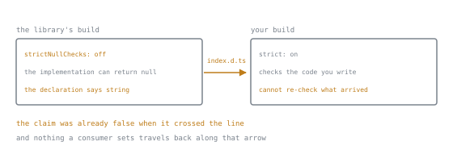

# Judgment

Lookup sheet for stage 7. The question it exists to answer: **which edit breaks a consumer, whose settings decided what a declaration is allowed to claim, and which construct still leaves something running once the type is gone?**

## Edit to verdict

An edit is safe exactly when every program that compiled against the old type still compiles against the new one, a question about assignability in a fixed direction, not about how large the edit looks on a diff. See [lesson 43](../lessons/0043-what-counts-as-a-breaking-change.md).

| Edit | Direction | Breaks a consumer | Diagnostic if it does |
|---|---|---|---|
| Parameter widened, `string` to `string \| number` | contravariant, safe | No | none |
| Parameter narrowed back down | contravariant, unsafe | Yes | `TS2345` |
| Return type narrowed, `string \| number` to `string` | covariant, safe | No | none |
| Return type widened further | covariant, unsafe | Yes | `TS2322` |
| Property added, optional | safe | No | none |
| Property added, required | unsafe | Yes | `TS2741` |
| Union member added to a returned union | breaks an exhaustiveness guard | Yes | `TS2322`, against the guard's `never` |
| Union member added to an accepted parameter's union | safe, same reasoning as widening | No | none |
| Removing a function, property, or exported type | no direction to check | Yes | `TS2305` |
| Renaming a published type, shape unchanged | looks safe, is not | Yes | `TS2305`; an import asks by name, shape does not answer that |
| Tightening a loose type to the truth, `any` to a real narrower type | looks safe, is not | Yes | `TS2322`; compatibility and correctness are separate |

## Publishing checklist

Three checks, run in order. See [lesson 44](../lessons/0044-publishing-a-type-surface.md).

1. **Generate.** Compile with `declaration` set, and `emitDeclarationOnly` too if a separate step already produces the JavaScript, then open the `.d.ts` the compiler actually wrote.
2. **Resolve from a scratch consumer.** Build a second, real package with its own `package.json` and `tsconfig.json`, install the library the way a real consumer would, and import the names a consumer would.
3. **Read the declaration.** Go through the `.d.ts` top to bottom, asking of every exported function whether each type it mentions is a primitive, exported by name, or accepted as unnamed.

Step 1 confirms only that the source type checks; step 2 only that resolution worked. Only step 3 catches a surface wider than intended, since a dragged-in internal type compiles as cleanly as a deliberately exported one. Step 2 is more forgiving than expected: with no `types` field and no `exports` map, resolution still finds a `.d.ts` beside whatever `main` names, the same fallback lesson 21 covers for a specifier missing its extension. The field only matters once that fallback finds nothing too, for example once a build moves the declaration file without updating a `types` condition; the consumer then gets the same `TS7016` a dependency shipping no declarations at all would produce.

## What the surface includes

An exported function's signature drags in every type it mentions, whether or not the author meant to publish that part; leaving it unexported removes only the name a consumer could use to write an annotation with. See [lesson 44](../lessons/0044-publishing-a-type-surface.md).

| Situation | What is public | What is missing |
|---|---|---|
| A type declared but never exported, reachable only because an exported function's signature mentions it | the shape, checked in full against any value a consumer passes | the name; `import { T } from "pkg"` fails with `TS2459` |

## The author's settings are part of the contract

The stage's sharpest finding, verified end to end: a loose author setting publishes a false declaration that no consumer's own strictness can detect, since the wrongness was baked in before the declaration reached them. See [lesson 45](../lessons/0045-the-consumers-settings-are-not-yours.md).

| Author's setting left off | What a loose value publishes | What a consumer can do | What a consumer cannot do |
|---|---|---|---|
| `strictNullChecks`, part of the `strict` family | a return type such as `string` where the implementation can return `null` | parse or narrow at the boundary, per lesson 31, or patch the declaration with a dated comment | turn on their own `strict`; it governs code the consumer writes, not an imported declaration |
| `noUncheckedIndexedAccess` | an indexed return typed `string` where the bound is unchecked, so it can be `undefined` | the same parse, narrow, or dated patch | turn on their own copy of the flag; the indexing already happened inside the library, out of the consumer's code |
| both, at once | two false claims behind one clean, confident declaration | treat the dependency as an unaudited boundary, the only real verification | reach for `skipLibCheck`; verified both ways, it checks a `.d.ts` for internal consistency, never against the implementation |

The last column of the table is a consequence of the arrow. A consumer's flags are not weaker than the author's, they are pointed at different code: everything to the right of the line. The declaration was already false to the left of it, and there is no second arrow going back.

A `tsconfig.json` behind a published package reads as a private build detail, but it decides which claims in the declaration are backed by a check, which makes it part of the interface whether a consumer reads it or not.

## What does not erase

`erasableSyntaxOnly` names, in the compiler's own words, what it exists to refuse: "Do not allow runtime constructs that are not part of ECMAScript." A construct fails it exactly when compiling it invents JavaScript beyond the plain expression underneath. See [lesson 46](../lessons/0046-the-typescript-that-does-not-erase.md).

| Construct | Verdict under `erasableSyntaxOnly` | Write instead |
|---|---|---|
| `enum Colour { Red, Green }` | `TS1294` | a union of string literals, `type Colour = "Red" \| "Green"`, unless the reverse mapping or iteration is genuinely used |
| `const enum E { A = 1 }` | `TS1294`, no exemption despite being advertised as inlined | the same union |
| `namespace N { ... }` | `TS1294` | an ordinary module, `import` and `export` |
| `constructor(private x: number)`, a parameter property | `TS1294` | the assignment written by hand, `this.x = x;` |
| a standard decorator on a class method | compiles, no diagnostic | nothing; legitimate as written |

The decorator row differs because a standard decorator is itself an ECMAScript feature, so the code it produces is JavaScript's own semantics, not a TypeScript invention, exactly the flag's line. The trap runs the other way: the same decorator under the older `experimentalDecorators` flag fails with `TS1241`, expecting the pre-ECMAScript calling convention; the fix is migrating the flag off, not the decorator. If the reverse mapping or iteration is genuinely needed, an `as const` object paired with a derived type, `(typeof Colour)[keyof typeof Colour]`, keeps a real value without the unwanted mapping, though it still lacks the numeric reverse lookup.

## Which source answers which question

TypeScript has no specification; an early attempt was abandoned years ago and nothing replaced it, so the compiler is the definition and every other document is commentary about what it does. See [lesson 47](../lessons/0047-settling-it-from-the-source.md).

| Question | Answer sits here |
|---|---|
| Did this change, and in which release | the release notes, recording what became true on a given date, not what is true today |
| What a construct actually does, rather than what it is supposed to do | the compiler's own shipped `lib` files, written by the same team that writes the checker enforcing them |
| Why the compiler behaves this way, when neither of the above says | the issue archive, a record of intent at a point in time, not of current behaviour |
| What happens right now, definitively | write the two lines and run the compiler you actually have; nothing outranks it |
| A general description, aimed at teaching rather than at stating every rule | the Handbook, which can lag the compiler it describes |

When a Handbook citation and a compiler diagnostic disagree, the diagnostic wins, and the review comment should quote it rather than paraphrase the page.

## Review

The method names three things rather than a reaction: what a construct costs, as a fact about the code; who pays; and what the alternative looks like. "This looks complicated" fails all three and gives the author nothing to fix. See [lesson 48](../lessons/0048-reviewing-typescript.md).

- **A conditional type.** Compare what the caller writes, and sees when wrong, against a plain generic doing the same job; wrong when the plainer alternative buys the same guarantee with a legible error, right only when the caller is measurably better off for having nothing left to narrow.
- **An assertion.** Ask what it claims, what establishes the claim, and if nothing does, what would; a defensible assertion carries a comment stating a checkable fact, and one without stands in for a check that never ran.
- **An `enum`.** Point at the mutable object with the reverse mapping it builds, the evidence lesson 46 verified in the emitted output, and ask whether the diff reads either direction of it; if not, a union of literals covers it and erases completely, and if iteration or the reverse lookup is genuinely needed, offer the `as const` fallback rather than repeat "avoid `enum`" as a slogan.
- **The shorter catches.** An `any` with no comment removes checking from everything built on it. A type predicate whose body does not test its `is` claim is trusted at every call site. A value crossing a boundary unparsed needs a schema check, not an assertion standing in for one. A hard-to-change published signature is lesson 43's territory: who rebuilds against it, and on what schedule.

"It compiles" is never an answer to a named cost, since every construct above compiles cleanly while doing exactly the damage described; a reply worth having names what the construct buys a caller that the alternative does not, or accepts the rewrite.

## Diagnostics seen in this stage

| `TS` number | Meaning | Usual cause |
|---|---|---|
| `TS1241` | unable to resolve a method decorator's signature | a standard decorator compiled under the legacy `experimentalDecorators` flag |
| `TS1294` | syntax not allowed under `erasableSyntaxOnly` | an `enum`, a `const enum`, a `namespace`, or a parameter property |
| `TS2305` | module has no exported member | an export removed, or a published type renamed with its shape unchanged |
| `TS2322` | not assignable | a narrowed parameter, a widened return type, a union member left over against a `never` guard, an inherited false return type, or a conditional type's own alias reported back unresolved |
| `TS2345` | argument not assignable | a published parameter narrowed back down |
| `TS2459` | module declares a name locally, but it is not exported | an unexported type reachable only through an exported signature |
| `TS2741` | required property missing | a required property added to a published interface |
| `TS7016` | could not find a declaration file for a module | a missing `types` field with no fallback present, or a `types` condition pointing where the file no longer sits |

## Sources

- [TypeScript Design Goals](https://github.com/microsoft/TypeScript/wiki/TypeScript-Design-Goals)
- [Handbook, Declaration Files](https://www.typescriptlang.org/docs/handbook/declaration-files/introduction.html)
- [TSConfig Reference](https://www.typescriptlang.org/tsconfig/)
- [Node, Modules, Packages](https://nodejs.org/api/packages.html)
- [TypeScript Release Notes](https://www.typescriptlang.org/docs/handbook/release-notes/overview.html)
- [Effective TypeScript](https://effectivetypescript.com/)
- [TypeScript Handbook, Conditional Types](https://www.typescriptlang.org/docs/handbook/2/conditional-types.html)
