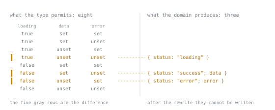

# Modelling

Lookup sheet for stage 4. The question it exists to answer: **which shape removes the illegal state, and which declaration catches the mistake where you made it?**

## Shape to state count

| Shape | States permitted | Replace with |
|---|---|---|
| Two optional fields describing alternatives, `a?: X; b?: Y` | product of each field's presence and absence, four for two fields | a discriminated union, one arm per domain state, tagged by a literal discriminant. See [lesson 22](../lessons/0022-discriminated-unions.md) and [lesson 24](../lessons/0024-illegal-states.md) |
| A flag beside the data it governs, `loading: boolean; data?: T; error?: string` | product of every field's own count, eight for three independent fields | one union arm per domain state, so each field is read only after checking which arm is held. See [lesson 24](../lessons/0024-illegal-states.md) |
| A field whose legality depends on another, `method: "pickup" \| "delivery"; address: string` | same count as if independent, since nothing stops the disallowed pairing | move the dependent field into only the arm that needs it. See [lesson 24](../lessons/0024-illegal-states.md) |
| A discriminant declared as `string` rather than a literal | as many as a correct union would have, since a check against it eliminates nothing | narrow the field to the literal union it should have been. See [lesson 22](../lessons/0022-discriminated-unions.md) |
| A bare primitive with a range or format the domain restricts, `price: number` | one state, since counting fields finds nothing to remove | a brand asserted once at construction, or validation at a boundary, stage 5's material. See [lesson 24](../lessons/0024-illegal-states.md) and [lesson 25](../lessons/0025-branded-types.md) |

The method behind every row above: count what the type permits, count what the domain produces, and if the first number is larger, name the difference and remove it. See [lesson 24](../lessons/0024-illegal-states.md).

The method run on the second row of the table, with the counts from [lesson 24](../lessons/0024-illegal-states.md): eight permitted, three produced. The five with no arm beside them are the difference, and they are not exotic. `{ loading: true, data: "x", error: "oops" }` is one of them, and it compiles.

## Discriminated union anatomy

| Requirement | What satisfies it |
|---|---|
| A shared property | every arm of the union declares it |
| The discriminant's type | a literal, not the general `string`, so a comparison against one value actually eliminates the other arms |
| The discriminant's value | a different literal in every arm, with no overlap between arms |
| The name | any identifier works, `kind`, `type`, `status` and `tag` all appear in real code; consistency across a codebase matters more than the name chosen |

See [lesson 22](../lessons/0022-discriminated-unions.md).

## Exhaustiveness

| | The `never` guard | No guard |
|---|---|---|
| Where it goes | `default` of a `switch`, or a final `else`, assigning the selector to `const _e: never` | relies on the declared return type alone |
| What it reports when a member is unhandled | the exact value or shape left over, by name, as `TS2322`, or `TS2345` through a helper such as `assertNever` | `TS2366`, a return statement is missing, not which case caused it |
| What it misses | nothing forces anyone to write the guard | fires only when the return type demands a value on every path; a `void` function gives no diagnostic at all for an unhandled case |

See [lesson 23](../lessons/0023-exhaustiveness-with-never.md).

## Brands

| What a brand blocks | What it permits | Where the assertion belongs |
|---|---|---|
| A plain value of the underlying primitive, or a different brand of the same primitive, from being passed where the brand is required, `TS2345` | the branded value flowing out to the underlying type for free, in an assignment or a method call, since every operation the primitive supports still works | inside the one function that establishes the invariant, written once, never repeated at a call site |

Checked at compile time only: the property a brand adds is erased by run time, so nothing distinguishes a careful assertion from a careless one except which function wrote it. See [lesson 25](../lessons/0025-branded-types.md).

## Generics

A type parameter earns its place when both are true:

- it appears more than once, tying together two or more positions such as a parameter and the return type
- a call site can infer it from an argument, so nobody has to spell it out by hand

Two signals that it does not:

- **it appears exactly once.** A concrete type or a union says as much as `T` did
- **no call site can ever infer it.** Every caller must write the type argument by hand, so the parameter saved nothing

See [lesson 26](../lessons/0026-generics-and-constraints.md).

## Check a value: the three forms

| Form | Checked against the type? | Inferred type kept? |
|---|---|---|
| annotation, `const c: T = value` | yes | no, `c` becomes `T` itself |
| `satisfies`, `value satisfies T` | yes | yes, `c` keeps whatever the literal would have inferred alone |
| `as`, `value as T` | no | not applicable, the written type is asserted rather than checked |

`satisfies` buys nothing on a value already typed `any`, since `any` passes trivially and has no narrower type to keep. See [lesson 27](../lessons/0027-satisfies.md).

## `interface` or `type`

| Question | `interface` | `type` |
|---|---|---|
| Names an object shape | yes | yes |
| Names a union, a tuple, or a primitive alias | no syntax for it, `TS1005` | yes |
| Two declarations sharing a name | merge into one | `TS2300`, duplicate identifier |
| Extending, with a conflicting member | rejected at the declaration, `TS2430` | compiles; the conflicting property becomes `never`, and construction fails later at whichever call site builds a value |
| Takes a type parameter | yes | yes |
| Erased at run time | yes | yes |

The decision rule, first line that applies wins: not an object shape, use `type`; public and may need extending by other code, prefer `interface`, since only it merges; built by extension where a conflict should be caught at the declaration, prefer `interface extends` over `&`; otherwise either works, and matching the codebase's existing choice matters more than which one is picked. See [lesson 28](../lessons/0028-interface-or-type.md).

## Diagnostics seen in this stage

| `TS` number | Meaning | Usual cause |
|---|---|---|
| `TS1005` | a token such as `{` or `,` was expected | `interface` written as a union, or `satisfies` in a parameter position |
| `TS1144` | `{` or `;` expected | `satisfies` written where a return type belongs |
| `TS2300` | duplicate identifier | two `type` aliases sharing a name, where two `interface` declarations would have merged instead |
| `TS2322` | not assignable | a member left over in a `never` assignment, a missing member on the matched arm, a plain value assigned to a branded type, a `satisfies` mismatch, or a conflicting intersection member found at construction |
| `TS2339` | property does not exist | reading a member only one arm has without narrowing, a non-literal discriminant, or an unconstrained type parameter's body |
| `TS2345` | argument not assignable | a widened discriminant passed as an argument, a call into `assertNever`, a mismatched brand, or a constrained generic called with the wrong type |
| `TS2353` | excess property on a fresh literal | a value naming a member that belongs to a different arm, whether checked by an annotation or by `satisfies` |
| `TS2365` | an operator cannot be applied | an unconstrained type parameter used with an operator not every type supports |
| `TS2366` | function lacks an ending return statement | a `switch` with no `default` and an unhandled member, under a non-`void` declared return type |
| `TS2430` | interface incorrectly extends interface | `interface extends` inheriting a member whose type conflicts with the base |

## Sources

- [TypeScript Handbook: Narrowing](https://www.typescriptlang.org/docs/handbook/2/narrowing.html)
- [TypeScript Handbook: Object Types](https://www.typescriptlang.org/docs/handbook/2/objects.html)
- [TypeScript Handbook: Generics](https://www.typescriptlang.org/docs/handbook/2/generics.html)
- [TypeScript Handbook: Declaration Merging](https://www.typescriptlang.org/docs/handbook/declaration-merging.html)
- [TypeScript 4.9 Release Notes, the satisfies operator](https://www.typescriptlang.org/docs/handbook/release-notes/typescript-4-9.html)
- [Effective TypeScript](https://effectivetypescript.com/)
- [TypeScript issue archive](https://github.com/microsoft/TypeScript/issues)
