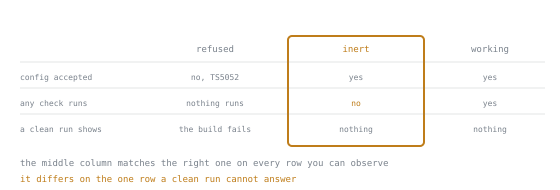

# Strictness and the Compiler

Lookup sheet for stage 3. The question it exists to answer: **which flag catches which failure, where did a setting come from, and will this import resolve?**

## The strict family

Seven flags default to `true` unless `strict` is `false`. An eighth is named by `tsc --all` but uncatalogued here.

| Flag | Catches | Diagnostic |
|---|---|---|
| `noImplicitAny` | unannotated parameter, nothing to infer | `TS7006` |
| `strictNullChecks` | `null`/`undefined` where not declared possible | `TS2322` |
| `strictFunctionTypes` | callback narrower than its function type | `TS2322` |
| `strictBindCallApply` | mismatch via `call`, `bind`, `apply` | `TS2345` |
| `strictPropertyInitialization` | class field never assigned in the constructor | `TS2564` |
| `noImplicitThis` | untyped `this` in a plain nested function | `TS2683` |
| `useUnknownInCatchVariables` | caught value used as a known shape | `TS2322` |
| `strictBuiltinIteratorReturn` | named in the family, uncatalogued this stage | none given |

`strictNullChecks` is load-bearing: off, `null` and `undefined` join every type rather than merely going unchecked. See [lesson 15](../lessons/0015-what-strict-turns-on.md).

## Checks `strict` omits

| Flag | Catches | Diagnostic | Needs `strictNullChecks` |
|---|---|---|---|
| `noUncheckedIndexedAccess` | index read past the end | `TS2322` | yes, else inert |
| `exactOptionalPropertyTypes` | `undefined` written into an optional property | `TS2375` | yes, else refused |
| `noImplicitReturns` | a branch falling out under a declared return type | `TS7030` | no |
| `noFallthroughCasesInSwitch` | a `case` with statements and no `break` | `TS7029` | no |
| `noPropertyAccessFromIndexSignature` | dot access on an index signature | `TS4111` | no |
| `noUnusedLocals` | a dead local | `TS6133` | no |

`tsc --init` turns on only the two needing `strictNullChecks`. See [lesson 16](../lessons/0016-the-checks-strict-leaves-out.md).

## Flag interaction, the three tiers

| Tier | Flags | What happens |
|---|---|---|
| Refused with `TS5052` | `strictPropertyInitialization`, `exactOptionalPropertyTypes` | rejected as configuration, no file read |
| Accepted but inert | `noUncheckedIndexedAccess` without `strictNullChecks` | compiles; no union forms, so a mismatch names the bare type |
| Working | any of the three, `strictNullChecks` on | reports honestly: a union, `TS2564`, or `TS2375` |

An inert flag reads as covered when nothing ran. The table above gives each tier a row; the columns show why the middle one is the dangerous tier rather than merely the useless one. It agrees with the working tier on both questions a reader can actually put to the compiler, and disagrees on the only one they cannot. A green build is evidence for either.

See [lesson 16](../lessons/0016-the-checks-strict-leaves-out.md).

## `unknown` against `any`

| Operation | `unknown` | `any` |
|---|---|---|
| assign in | compiles | compiles |
| assign out to a typed variable | `TS2322` until narrowed | compiles, no check |
| read a property or call it | `TS18046` until narrowed | compiles regardless of shape |
| narrow with `typeof`, `instanceof` | behaves like any narrowed type | nothing to narrow |
| chain a deep property read | blocked at the first step | stays `any`, no diagnostic |
| default catch variable type | `unknown` | only with `catch (e: any)` explicit |
| annotate catch as a specific type | `TS1196` refused | same refusal |

See [lesson 17](../lessons/0017-unknown-instead-of-any.md).

## Escape hatches

| Mechanism | Costs | Can go stale |
|---|---|---|
| `as`, between overlapping types | turns off the one overlap check | yes, silently |
| `as unknown as` | defeats the overlap guard entirely | yes, looks like honest `unknown` use |
| `!` | removes `null`/`undefined` without checking absence | yes, a lie when the value is absent |
| `@ts-ignore` | suppresses whatever lands on the next line | yes, forever, no signal once dead |
| `@ts-expect-error` | suppresses a diagnostic only if one exists | no; `TS2578` once its claim is false |

See [lesson 18](../lessons/0018-an-assertion-is-not-a-check.md).

## `tsconfig` anatomy

| Field | Decides | The gotcha |
|---|---|---|
| `include` | glob seed set, relative to the config file | not the whole program |
| `exclude` | narrows what `include` found | an import overrides it |
| `files` | exact allow list, no globs | must exist; `exclude` cannot veto it |
| `extends` | merges a base config, extender wins ties | resolves relative paths against the base file |
| `tsc --showConfig` | the fully merged, effective configuration | implied settings show; `strict` never expands |
| `skipLibCheck` | whether `.d.ts` files are checked | hides a mismatch between duplicate type packages |
| `types` | which `@types` packages contribute globals | defaults to none since TypeScript 6.0 |
| bare files beside `tsconfig.json` | refused outright | `TS5112`; `--ignoreConfig` restores the old behaviour |

See [lesson 19](../lessons/0019-reading-a-tsconfig.md).

## `target` against `lib`

| Setting | Governs | The gotcha |
|---|---|---|
| `target` | emitted JavaScript, e.g. a private field lowered to a `WeakMap` | never decides whether code type-checks |
| `lib` | declarations available to the checker | naming it **replaces** the default bundle, never adds to it |
| default | `target` chooses a `lib` bundle when none is named | raising `target` is usually safer than naming `lib` |
| DOM | part of every target's default bundle | on by default, even off a browser |
| `target: es5` | removed in TypeScript 7 | `TS5108`, refused before any source file is read |

See [lesson 20](../lessons/0020-target-and-lib.md).

## Module resolution

Identical options, opposite verdicts, keyed on `package.json`, for a specifier resolving to `dep.ts` on disk.

| `package.json` | Import in `main.ts` | Verdict |
|---|---|---|
| `{"type": "module"}` | `from "./dep"` | `TS2835`, extension required |
| `{"type": "module"}` | `from "./dep.js"` | compiles, the future emitted extension |
| `{"type": "module"}` | `from "./dep.ts"` | `TS5097`, unless `allowImportingTsExtensions` |
| `{}`, or no `type` | `from "./dep"` | compiles, CommonJS keeps extensions optional |

Write the extension the emitted file will have, not the one on disk. Module system order: `.mts` is always ESM, `.cts` always CommonJS, else the nearest `package.json`'s `type`, else CommonJS. `verbatimModuleSyntax` refuses a silently elided type-only import: a plain import of a type-only `T` gives `TS1484` unless written `import { type T }`. See [lesson 21](../lessons/0021-module-resolution.md).

## Diagnostics seen in this stage

| `TS` number | Meaning | Usual cause |
|---|---|---|
| `TS7006` | parameter implicitly `any` | no annotation, nothing to infer |
| `TS2322` | not assignable | unhandled `null`/`undefined`, narrower callback, or unnarrowed value |
| `TS2345` | argument not assignable | mismatch via `call`, `bind`, `apply` |
| `TS2564` | no initialiser | class field never set in the constructor |
| `TS2683` | `this` implicitly `any` | plain function reading `this`, no receiver |
| `TS5052` | option needs another option | flag needs `strictNullChecks` first |
| `TS2375` | optional property assignment fails | `undefined` under `exactOptionalPropertyTypes` |
| `TS7030` | not all paths return | branch falls out, declared return type |
| `TS7029` | fallthrough case in switch | statements with no `break` |
| `TS4111` | index signature accessed by dot | `m.anything` instead of `m["anything"]` |
| `TS6133` | declared but never used | dead local |
| `TS18046` | value is `unknown` | used before narrowing |
| `TS1196` | catch type must be `any`/`unknown` | specific type named on `catch` |
| `TS2352` | conversion may be a mistake | `as` between types sharing nothing |
| `TS2578` | unused `@ts-expect-error` | expected error gone |
| `TS5108` | option removed | `target: es5` |
| `TS2550` | property missing, check target library | method newer than current `lib` |
| `TS2584` | cannot find name, check target library | `lib` named, dropped a default global |
| `TS2304` | cannot find name | undeclared global, or unnamed ambient package |
| `TS2835` | relative import needs an extension | extensionless specifier, ESM package, `nodenext` |
| `TS5097` | import path can only end in `.ts` | source extension instead of the emitted one |
| `TS5096` | `allowImportingTsExtensions` needs a no-emit setting | enabled while still emitting |
| `TS5112` | `tsconfig.json` ignored, files given on the command line | files passed with a real config present |
| `TS2353` | excess property on a fresh literal | silenced by `as` |
| `TS1484` | type needs a type-only import | `verbatimModuleSyntax` on, `type` keyword missing |

## Sources

- [TSConfig Reference](https://www.typescriptlang.org/tsconfig/)
- [TypeScript Handbook: Everyday Types](https://www.typescriptlang.org/docs/handbook/2/everyday-types.html)
- [TypeScript Handbook: More on Functions, `unknown`](https://www.typescriptlang.org/docs/handbook/2/functions.html#unknown)
- [Handbook, Modules, Theory](https://www.typescriptlang.org/docs/handbook/modules/theory.html)
- [Handbook, Modules, Reference](https://www.typescriptlang.org/docs/handbook/modules/reference.html)
- [TypeScript Design Goals](https://github.com/microsoft/TypeScript/wiki/TypeScript-Design-Goals)
- [TypeScript Release Notes](https://www.typescriptlang.org/docs/handbook/release-notes/overview.html)
- [Node, Packages](https://nodejs.org/api/packages.html)
